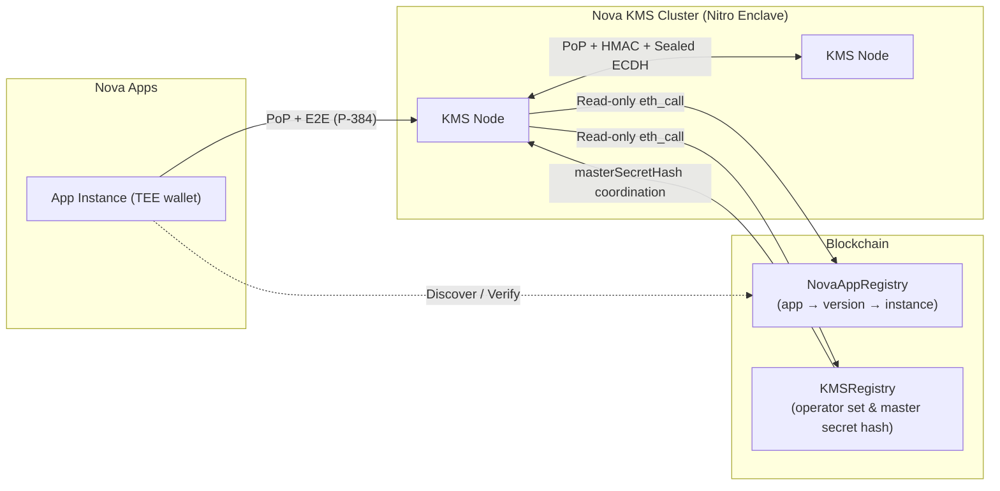

# Nova KMS

Distributed Key Management Service for the Nova Platform. Runs inside AWS Nitro Enclaves and provides **key derivation** and an **in-memory KV store** to other Nova applications.

It is designed with a **Zero-Trust** architecture where no single node is trusted by default. Trust is established via on-chain registries, cryptographic proofs, and **strict initialization protocols**.

## Features

| Feature | Description |
|---------|-------------|
| **Key Derivation (KDF)** | HKDF-SHA256 from a shared cluster master secret, partitioned by on-chain App ID. |
| **In-Memory KV Store** | Per-app namespace, vector-clock versioning, TTL, LRU eviction. Values are encrypted-at-rest (AES-GCM). |
| **Distributed Sync** | Delta + snapshot sync across KMS nodes (Eventual Consistency, Last-Writer-Wins). |
| **Dual Keypairs** | Separated keys for Identity (secp256k1) and Encryption (P-384/secp384r1). |
| **Master Secret Bootstrap** | Bootstrap from `MASTER_SECRET_HEX` or sealed ECDH sync from a healthy peer. |

## Rust/Python Compatibility

The Rust node now matches the legacy Python node on protocol surface and sync behavior:

- Same PoP message formats:
  - `NovaKMS:AppAuth:<NonceBase64>:<KMS_Wallet>:<Timestamp>`
  - `NovaKMS:Auth:<NonceBase64>:<Recipient_Wallet>:<Timestamp>`
- Same nonce contract: `GET /nonce` returns 16-byte random nonce encoded in base64.
- Same route surface:
  - `GET /`, `GET /health`, `GET /status`, `GET /nodes`, `GET /nonce`
  - `POST /kms/derive`
  - `GET /kms/data`, `GET /kms/data/{key:path}`, `PUT /kms/data`, `DELETE /kms/data`
  - `POST /sync`
- Same `/sync` semantics: PoP + optional HMAC (`X-Sync-Signature`) + E2E envelope + mutual response signature.
- Same sync payload structure for records (`value` hex, vector clock map, tombstone, ttl, updated timestamp).

This allows mixed Python/Rust KMS clusters to exchange deltas/snapshots and sealed master-secret sync.

## Runtime Configuration

Important environment variables (all are read by `Config::load()`):

- `IN_ENCLAVE` (`true|false`)
- `BIND_ADDR` (default `0.0.0.0:8000`)
- `NODE_URL` (RPC URL)
- `NODE_INSTANCE_URL` (this node public URL)
- `NODE_WALLET` (TEE wallet address)
- `NODE_PRIVATE_KEY` (dev-only signing key for PoP/mutual signatures)
- `MASTER_SECRET_HEX` (optional bootstrap secret)
- `KMS_APP_ID`
- `NOVA_APP_REGISTRY_ADDRESS`, `KMS_REGISTRY_ADDRESS`
- `KMS_NODE_TICK_SECONDS`, `DATA_SYNC_INTERVAL_SECONDS`
- `PEER_CACHE_TTL_SECONDS`, `REGISTRY_CACHE_TTL_SECONDS`
- `PEER_BLACKLIST_DURATION_SECONDS`
- `ALLOW_PLAINTEXT_DEV` (dev-only fallback, defaults to `false`)

Legacy env aliases remain accepted for compatibility:
- `SYNC_INTERVAL_SECONDS` -> `DATA_SYNC_INTERVAL_SECONDS`
- `PEER_REFRESH_INTERVAL_SECONDS` -> `KMS_NODE_TICK_SECONDS`

## Security Architecture

The system implements a **Defense in Depth** strategy with four layers of security:

### 1. On-Chain Identity & Authorization (The "Who")
*   **Nodes (KMS↔KMS)**: A peer must be a registered `ACTIVE` instance in `NovaAppRegistry` under `KMS_APP_ID`, with app `ACTIVE`, version not `REVOKED` (currently `ENROLLED` or `DEPRECATED`), and `zkVerified=true`.
*   **Apps (App→KMS)**: A caller must be a registered `ACTIVE` instance in `NovaAppRegistry` whose app is `ACTIVE`, version not `REVOKED` (currently `ENROLLED` or `DEPRECATED`), and `zkVerified=true`.
*   **KMSRegistry**: Not used for runtime peer discovery.
*   **Verification**: All access gates on `NovaAppRegistry` lookups (instance/app/version status + `zkVerified`).

### 2. Mutual Authentication (The "Handshake")
*   **Mechanism**: Lightweight Proof-of-Possession (PoP) signatures (EIP-191).
*   **Flow**:
    1.  Caller requests a `nonce`.
    2.  Caller signs a recipient-bound message:
        - **App→KMS**: `NovaKMS:AppAuth:<NonceBase64>:<KMS_Wallet>:<Timestamp>`
        - **KMS↔KMS**: `NovaKMS:Auth:<NonceBase64>:<Recipient_Wallet>:<Timestamp>`
    - **Wallet canonicalization**: wallet strings MUST be `0x` + 40 lowercase hex characters.
    3.  Recipient verifies signature and checks registry status.
    4.  Recipient returns a signed response: `NovaKMS:Response:<Caller_Sig>:<My_Wallet>`.

### 3. End-to-End Encryption (The "Tunnel")
*   **Mechanism**: NIST P-384 ECDH + AES-256-GCM.
*   **Key**: Uses the separate `teePubkey` (P-384) registered on-chain.
*   **Benefit**: Ensures confidentiality even if TLS is terminated at a load balancer.

### 4. Data Integrity (The "Guard")
*   **Mechanism**: HMAC-SHA256 signatures for `/sync`.
*   **Purpose**: Defense-in-depth for inter-node sync; rejects peers that don’t share the cluster sync key.
*   **Details**: When a sync key is configured, nodes require `X-Sync-Signature` on `/sync`.

## Registry and Cache Model

Runtime authorization uses two explicit paths:

1. **App requests (`/kms/*`)** use `CachedNovaRegistry` (read-through cache for `NovaAppRegistry`).
2. **KMS peer sync (`/sync`)** uses `PeerCache` refreshed by `node_tick`.

Details: see [`docs/cache-and-registry-model.md`](docs/cache-and-registry-model.md).

## Architecture Diagram



## Master Secret Bootstrap

Nodes support two bootstrap modes:

1.  **Direct bootstrap**: set `MASTER_SECRET_HEX` on startup.
2.  **Peer bootstrap**: if local secret is missing, request sealed master secret from a verified peer via `/sync` (`master_secret_request` + ECDH envelope), then pull snapshot data.

## Project Structure

## Project Structure

```
nova-kms/
├── contracts/           # Solidity (KMSRegistry + tests)
├── demo-client/         # Reference Client (Python, manual PoP/E2E flow)
├── demo-client-enclaver/ # Reference Client (Python, using enclaver /v1/kms/*)
├── src/                 # Rust KMS application
│   ├── main.rs          # Tokio entry point & graceful shutdown
│   ├── server.rs        # Axum router & REST API definitions
│   ├── auth.rs          # PoP auth & Registry integration middleware
│   ├── crypto.rs        # HKDF / AES-GCM / HMAC utilizing `ring`
│   ├── sync.rs          # Peer discovery, vector clock active sync
│   ├── store.rs         # Namespaced thread-safe LRU Key-Value Store
│   ├── odyn.rs          # Enclaver TEE Client API binding
│   └── ...
├── tests/               # Behavior Parity comparisons checks
├── docs/                # Detailed Documentation
├── Dockerfile           # Multi-stage container image for AWS Nitro
├── enclaver.yaml        # Enclaver deployment properties
└── Makefile             # Developer commands (Cargo wrappers)
```

## Quick Start

See `docs/development.md` for local development instructions. Note that `nova-kms` is designed to run within a Nitro Enclave environment.

## Tests

```bash
cd nova-kms

# Rust unit tests
cargo test

# Cross-language crypto parity (Python reference vs Rust)
python3 tests/compare_behavior.py
```

## Client Integration

Clients can follow either pattern:

1.  `demo-client/`: manual KMS interaction (node discovery + PoP + E2E envelope handling).
2.  `demo-client-enclaver/`: simplified flow via enclaver `Odyn /v1/kms/*` APIs.

## License

Apache-2.0
