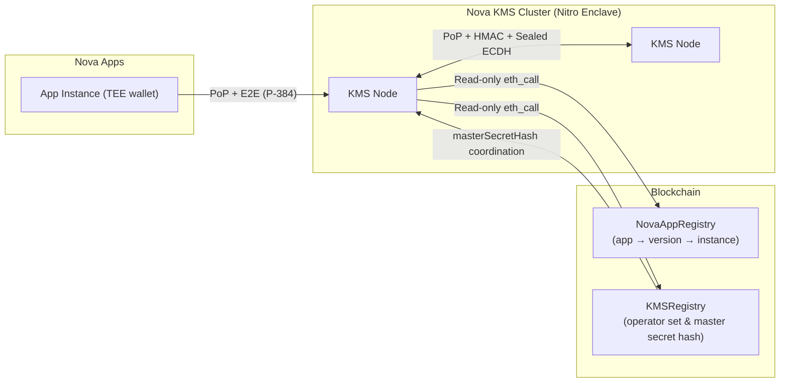

# Nova KMS

Distributed Key Management Service for the Nova Platform. Runs inside AWS Nitro Enclaves and provides **key derivation** and an **in-memory KV store** to other Nova applications.

It is designed with a **Zero-Trust** architecture where no single node is trusted by default. Trust is established via on-chain registries, cryptographic proofs, and **strict initialization protocols**.

## Features

| Feature | Description |
|---------|-------------|
| **Key Derivation (KDF)** | HKDF-SHA256 from a shared cluster master secret, partitioned by on-chain App ID. |
| **In-Memory KV Store** | Per-app namespace, vector-clock versioning, TTL, LRU eviction. Values are encrypted-at-rest (AES-GCM). |
| **Distributed Sync** | Delta + snapshot sync across KMS nodes (Eventual Consistency, Last-Writer-Wins). |
| **Dual Keypairs** | Separated keys for Identity (secp256k1) and Encryption (P-384/secp384r1). |
| **Anti-Split-Brain** | Strict initialization logic using the on-chain `masterSecretHash` coordination value. |

## Security Architecture

The system implements a **Defense in Depth** strategy with four layers of security:

### 1. On-Chain Identity & Authorization (The "Who")
*   **Nodes (KMS↔KMS)**: A peer must be a registered `ACTIVE` instance in `NovaAppRegistry` under `KMS_APP_ID` with an `ENROLLED` version.
*   **Apps (App→KMS)**: A caller must be a registered `ACTIVE` instance in `NovaAppRegistry` whose app is `ACTIVE` and version is `ENROLLED`.
*   **KMSRegistry**: Not used for runtime peer discovery; it is used for cluster coordination via `masterSecretHash` (and may be used for optional audits/ops checks).
*   **Verification**: All access gates on `NovaAppRegistry` lookups (instance/app/version status + `zkVerified`).

### 2. Mutual Authentication (The "Handshake")
*   **Mechanism**: Lightweight Proof-of-Possession (PoP) signatures (EIP-191).
*   **Flow**:
    1.  Caller requests a `nonce`.
  2.  Caller signs a recipient-bound message:
    - **App→KMS**: `NovaKMS:AppAuth:<NonceBase64>:<KMS_Wallet>:<Timestamp>`
    - **KMS↔KMS**: `NovaKMS:Auth:<NonceBase64>:<Recipient_Wallet>:<Timestamp>`
    3.  Recipient verifies signature and checks registry status.
    4.  Recipient returns a signed response: `NovaKMS:Response:<Caller_Sig>:<My_Wallet>`.

### 3. End-to-End Encryption (The "Tunnel")
*   **Mechanism**: NIST P-384 ECDH + AES-256-GCM.
*   **Key**: Uses the separate `teePubkey` (P-384) registered on-chain.
*   **Benefit**: Ensures confidentiality even if TLS is terminated at a load balancer.

### 4. Data Integrity (The "Guard")
*   **Mechanism**: HMAC-SHA256 signatures for `/sync`.
*   **Purpose**: Defense-in-depth for inter-node sync; rejects peers that don’t share the cluster sync key.
*   **Details**: When a sync key is configured, nodes require `X-Sync-Signature` on `/sync` (except `master_secret_request` bootstrap). The signature is computed over the canonical JSON of the **on-the-wire request body** (the E2E envelope when encryption is used).

## Architecture Diagram



## Anti-Split-Brain Initialization

To prevent cluster fragmentation, nodes follow a strict startup protocol:

1.  **Check Chain**: Read `masterSecretHash` from `KMSRegistry`.
2.  **If Hash == 0**:
    *   **Optimistic Init**: Generate new secret & attempt to set hash on-chain.
    *   **Defense**: Implementation uses `masterSecretHash` as a mutex—first successful transaction wins.
    *   **Retry**: If tx fails (race lost), loop back to step 1.
3.  **If Hash != 0**:
    *   **Verify**: Does my local secret match the hash?
        *   **Yes**: Node Ready.
        *   **No**: **Attempt Sync** from a verified peer.
            *   **Success** (Hash matches): Node Ready.
            *   **Failure** (Network error or Hash mismatch): Stay Offline (Retry Loop).

## Project Structure

```
nova-kms/
├── contracts/           # Solidity (KMSRegistry + tests)
├── enclave/             # Python KMS application
│   ├── app.py           # FastAPI entry point
│   ├── auth.py          # PoP auth & Registry integration
│   ├── kdf.py           # Key Derivation & Master Secret management
│   ├── secure_channel.py# E2E Encryption (P-384) & ECDH
│   ├── sync_manager.py  # Peer sync & HMAC logic
│   └── ...
├── tests/               # Python (pytest) & Solidity (forge) tests
├── docs/                # Detailed Documentation
├── Dockerfile           # Production Docker image
└── Makefile             # Developer commands
```

## Quick Start (Simulation)

To run a local simulation (no Enclave, mocked Registry):

```bash
# 1. Setup
python3 -m venv .venv && source .venv/bin/activate
pip install -r enclave/requirements.txt

# 2. Run
make simulation
# Listens on localhost:4000

# 3. Verify
curl http://localhost:4000/status
```

## Client Integration

Clients should use the `nova-kms-client` pattern (see `nova-examples/`):

1.  **Discover**: Query `NovaAppRegistry` for `ACTIVE` instances of the KMS App ID.
2.  **Authenticate**: Use `Odyn` SDK to sign PoP headers.
3.  **Encrypt**: Encrypt sensitive payloads using the target node's `teePubkey`.

## License

Apache-2.0