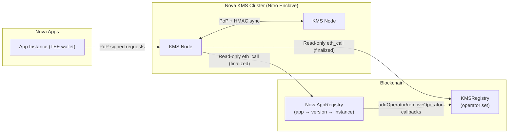

# Nova KMS

Distributed Key Management Service for the Nova Platform. Runs inside AWS Nitro Enclave and provides **key derivation**, **certificate signing**, and an **in-memory KV store** to other Nova applications — all secured by **Proof-of-Possession (PoP) signatures** and on-chain **App Registry** verification.

## Features

| Feature | Description |
|---------|-------------|
| **Key Derivation (KDF)** | HKDF-SHA256 from a shared cluster master secret, partitioned by app ID |
| **In-Memory KV Store** | Per-app namespace, vector-clock versioning, TTL, LRU eviction; values are stored encrypted-at-rest (AES-GCM) |
| **Distributed Sync** | Delta + snapshot sync across KMS nodes (eventual consistency, LWW) |
| **PoP Auth** | Proof-of-Possession signatures; app identity verified via NovaAppRegistry |
| **On-Chain Membership** | KMSRegistry contract tracks nodes; client probes determine health |

## Architecture



Key points:
- **Read-only on-chain access**: KMS nodes do not submit transactions; they only query `NovaAppRegistry` and `KMSRegistry`.
- **App identity is derived, not trusted**: the KMS maps the caller's PoP-recovered TEE wallet to `appId` via `NovaAppRegistry`.
- **Cluster secret + per-app derivation**: keys are derived from a shared master secret; KV values are stored encrypted-at-rest using a per-app data key.
- **Two modes**: production runs inside an enclave; simulation mode is for local development and cannot run when `IN_ENCLAVE=true`.

See [docs/architecture.md](docs/architecture.md) for the full design.

## Quick Start

### Local Development

```bash
# 1. Setup Python environment
python3 -m venv .venv && source .venv/bin/activate
pip install -r enclave/requirements.txt

# 2. Edit config
#    → enclave/config.py (set contract addresses)

# 3. Run
make simulation
# Server at http://localhost:4000

# 4. Test
curl http://localhost:4000/health
curl http://localhost:4000/status
```

### Run Tests

```bash
# Python tests
pip install pytest httpx
pytest tests/ -v

# Solidity tests
cd contracts && forge test -vvv
```

### Deploy Contracts

```bash
cd contracts
export NOVA_APP_REGISTRY_PROXY=0x...
export PRIVATE_KEY=0x...

# 1. Deploy
make deploy

# 2. Set App ID (after assigned by platform)
export CONTRACT_ADDRESS=0x...
export KMS_APP_ID=...
make set-app-id
```

## API Reference

| Endpoint | Method | Auth | Description |
|----------|--------|------|-------------|
| `/health` | GET | None | Health check |
| `/status` | GET | None | Node + cluster status |
| `/nonce` | GET | None | Issue one-time PoP nonce |
| `/nodes` | GET | None | List KMS operators |
| `/kms/derive` | POST | App PoP | Derive application key |
| `/kms/data` | GET/PUT/DELETE | App PoP | App-scoped KV store |
| `/sync` | POST | Peer PoP + HMAC | Inter-node synchronization |

### Example: Derive a Key

```bash
curl -X POST https://kms.example.com/kms/derive \
  -H "Content-Type: application/json" \
  -d '{"path": "disk_encryption", "context": "v1"}'
```

Response:
```json
{
  "app_id": 42,
  "path": "disk_encryption",
  "key": "base64_encoded_32_byte_key",
  "length": 32
}
```

## Documentation

| Document | Description |
|----------|-------------|
| [Architecture](docs/architecture.md) | System design, contracts, auth flows, sync protocol |
| [Development](docs/development.md) | Local setup, module overview, environment variables |
| [Testing](docs/testing.md) | Test suites, running tests, CI integration |
| [Deployment](docs/deployment.md) | Production deployment, multi-node, monitoring |

## Project Structure

```
nova-kms/
├── contracts/           # Solidity (KMSRegistry + tests)
│   ├── src/
│   ├── test/
│   └── script/
├── enclave/             # Python KMS application
│   ├── app.py           # FastAPI entry point
│   ├── auth.py          # PoP auth + registry verification
│   ├── chain.py         # Blockchain RPC helpers
│   ├── config.py        # Configuration constants
│   ├── data_store.py    # In-memory KV store
│   ├── kdf.py           # HKDF + CA
│   ├── kms_registry.py  # KMSRegistry wrapper
│   ├── nova_registry.py # NovaAppRegistry wrapper
│   ├── odyn.py          # TEE SDK (DO NOT MODIFY)
│   ├── probe.py         # Liveness probing
│   ├── routes.py        # API endpoints
│   ├── sync_manager.py  # Peer synchronization
├── scripts/             # Bash scripts for development
│   ├── run_dev.sh
│   └── run_multi_node.sh
├── tests/               # Python tests
├── docs/                # Documentation
├── Dockerfile           # Production Docker image
├── Makefile             # Project management
├── enclaver.yaml        # Enclaver config
└── nova-build.yaml      # Build config
```

## License

Apache-2.0