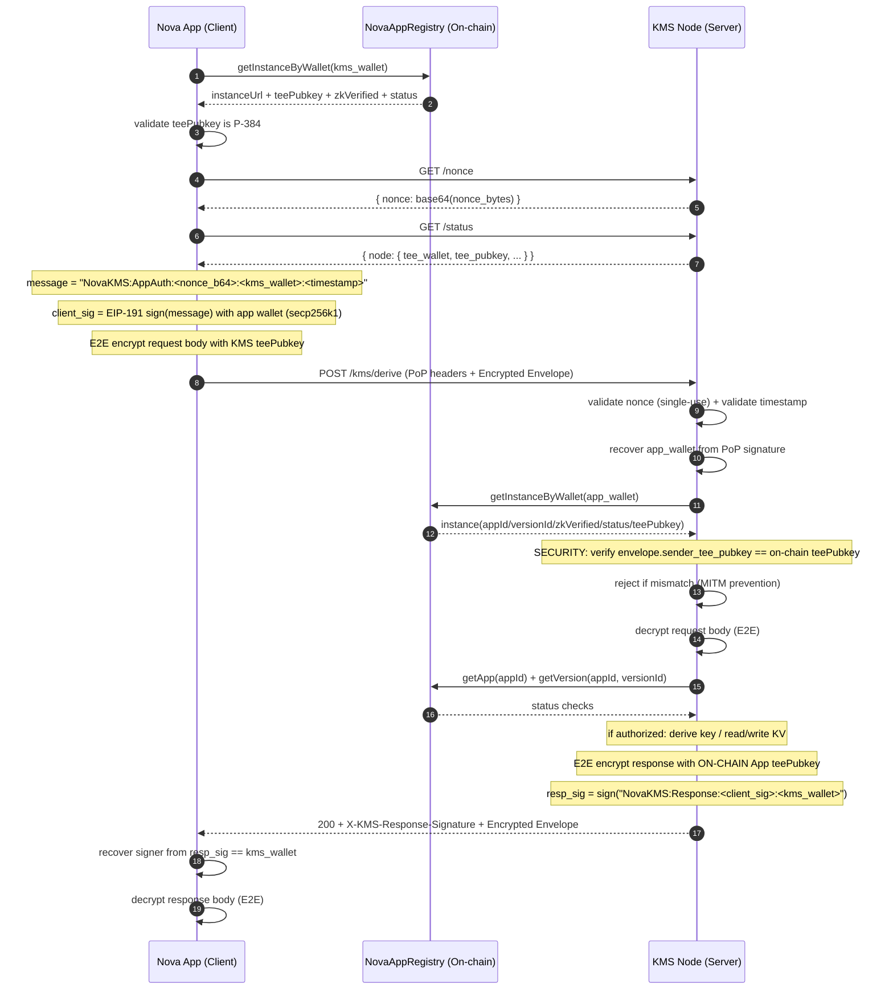
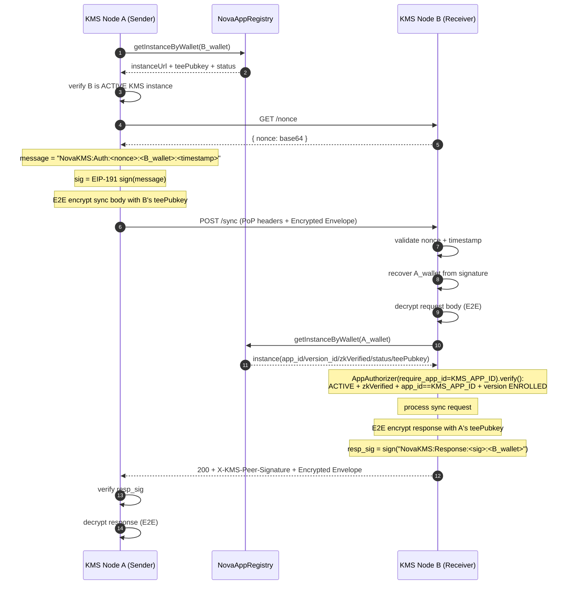

# Nova App ↔ KMS Node Connection & Authentication (Current Implementation)

This document describes the end-to-end flow for a **Nova App (client)** to connect to **Nova KMS (server)** and complete request authentication / mutual proof.

> **Note**: The current implementation uses **PoP (EIP-191 signatures) + on-chain authorization checks + teePubkey-based E2E encryption**.
>
> - **App→KMS**: PoP authentication + E2E encrypted payloads (using Odyn's P-384 ECDH + AES-256-GCM)
> - **KMS↔KMS**: PoP authentication + E2E encrypted sync messages + sealed master secret exchange

---

## 0. Two Independent Keypairs (Must Be Clear Up Front)

Each enclave instance has two **fully independent** keypairs:

- **ETH wallet (secp256k1)**: on-chain field `teeWalletAddress`, used for signing (PoP / response mutual signature).
- **teePubkey (P-384 / secp384r1)**: on-chain field `teePubkey` (typically DER/SPKI), used for **E2E encryption** of all sensitive payloads.

They are different keypairs on different curves:
- the wallet address is **NOT** derived from `teePubkey`
- `teePubkey` is **NOT** derived from the wallet

---

## 1. Discover Available KMS Nodes (Registry Only)

The only secure way to discover KMS nodes is by querying the on-chain `NovaAppRegistry`. This ensures you are connecting to an **ACTIVE**, **zkVerified** instance of the official KMS App.

### 1.1 Lookup Logic

1.  **Input:** `KMS_APP_ID` (The App ID of the KMS service).
2.  **Steps:**
    *   Get the `App` record for `KMS_APP_ID`.
    *   Iterate through `ENROLLED` versions.
    *   Find all `ACTIVE` instances for those versions.
3.  **Output:** A list of active KMS instances, including their:
    *   `instanceUrl` (e.g. `https://kms-node-1.example.com`)
    *   `teeWalletAddress` (The verified EVM identity of the enclave)
    *   `teePubkey` (The verified P-384 public key for encryption)

> [!IMPORTANT]
> **Zero Trust Verification**: You MUST use the `teePubkey` and `teeWalletAddress` obtained from the Registry. Do NOT trust values returned by the KMS node itself until you have verified them against the Registry.

---


## 2. App → KMS: Full PoP-authenticated Request Flow with E2E Encryption

### 2.1 Overview (Sequence)



### 2.2 E2E Encryption Envelope Format

All sensitive request/response bodies are wrapped in an encryption envelope:

```json
{
  "sender_tee_pubkey": "<P-384 DER SPKI public key, hex>",
  "nonce": "<AES-GCM nonce, hex>",
  "encrypted_data": "<encrypted payload, hex>"
}
```

- **sender_tee_pubkey**: The sender's P-384 public key (verified against on-chain registration)
- **nonce**: 12-byte AES-GCM nonce
- **encrypted_data**: AES-256-GCM encrypted JSON payload

**SECURITY**: The server verifies that `sender_tee_pubkey` matches the on-chain registered teePubkey for the authenticated wallet. This prevents MITM attacks where an attacker re-encrypts requests with their own key.

The encryption uses Odyn's built-in ECDH + AES-256-GCM:
- Sender calls `Odyn.encrypt(plaintext, receiver_tee_pubkey)`
- Receiver calls `Odyn.decrypt(nonce, sender_tee_pubkey, encrypted_data)`

---

## 3. Concrete Request Details (Aligned to Current Code)

### 3.1 Fetch Nonce

- `GET /nonce`
- returns: `{"nonce": "<base64>"}`
- the server applies a simple rate limit to `/nonce` (see `routes.py`)


### 3.2 App generates the PoP signature

The app must know the target node’s `kms_wallet` (i.e. the node’s on-chain `teeWalletAddress`). You can also obtain it from `GET /status` → `node.tee_wallet`.

Signature message (the server verifies this format exactly):

- `NovaKMS:AppAuth:<NonceBase64>:<KMS_Wallet>:<Timestamp>`

Where:
- `NonceBase64`: the `nonce` field from `GET /nonce` (base64 text, not raw bytes)
- `KMS_Wallet`: the destination node wallet (recipient binding; prevents reusing the signature for another node)
- `Timestamp`: unix seconds

**Wallet canonicalization**: `KMS_Wallet` MUST be a canonical Ethereum address string: `0x` + 40 lowercase hex characters.

Server-side logic in `nova-kms/enclave/auth.py`:
- nonce must be single-use and unexpired (it is consumed)
- timestamp must be within the allowed window (`POP_MAX_AGE_SECONDS`)
- the recovered wallet from the signature is the real identity (`X-App-Wallet` is an optional hint, but if provided must match)

### 3.3 App request headers

Required headers for App→KMS:

- `X-App-Signature`: `client_sig` (hex)
- `X-App-Nonce`: `nonce_b64`
- `X-App-Timestamp`: `timestamp`
- `X-App-Wallet`: (optional) explicit wallet address; if provided it must match the recovered signer

### 3.4 Example business request: POST /kms/derive

- `POST /kms/derive`

**Request body** (E2E encrypted envelope containing the inner payload):

```json
{
  "sender_tee_pubkey": "<app's P-384 teePubkey, hex>",
  "nonce": "<AES-GCM nonce, hex>",
  "encrypted_data": "<encrypted JSON: {\"path\": \"some_key_path\", \"context\": \"\", \"length\": 32}>"
}
```

**Response body** (E2E encrypted envelope):

```json
{
  "sender_tee_pubkey": "<KMS's P-384 teePubkey, hex>",
  "nonce": "<AES-GCM nonce, hex>",
  "encrypted_data": "<encrypted JSON: {\"key\": \"<base64 derived key>\", \"path\": \"...\"}>"
}
```

If the client used PoP, the server adds a mutual response signature header:

- `X-KMS-Response-Signature`

The signed message is:

- `NovaKMS:Response:<client_sig>:<kms_wallet>`

Implementation: `_add_mutual_signature()` in `nova-kms/enclave/routes.py`.

---

## 5. Server-side Authorization Checks (On-chain checkpoints)

After authentication succeeds, the server authorizes the request via `AppAuthorizer.verify()`:

1. `getInstanceByWallet(app_wallet)`
2. instance must satisfy:
  - `status == ACTIVE`
  - `zkVerified == true`
3. `getApp(appId)`: App must be `ACTIVE`
4. `getVersion(appId, versionId)`: Version must be `ENROLLED`

Implementation: `nova-kms/enclave/auth.py`.

---

## 6. How the client verifies the mutual response signature (X-KMS-Response-Signature)

Example client implementation: `nova-examples/nova-kms-client/enclave/kms_identity.py`:

- construct `NovaKMS:Response:<client_sig>:<kms_wallet>`
- recover the signer address using EIP-191
- verify recovered == kms_wallet

---

## 7. Common Failure Cases (What you will see)

- `429`: `GET /nonce` rate limited
- `403`: missing PoP / expired nonce / stale timestamp / signature mismatch / on-chain authorization failed
- `503`: KMS master secret not initialized (e.g. `/kms/derive`) or service not ready

---

## Appendix A: KMS ↔ KMS Authentication and Sync

KMS nodes are regular Nova apps registered under `KMS_APP_ID`. The KMS↔KMS authentication follows the **same pattern as App→KMS**, using `AppAuthorizer(require_app_id=KMS_APP_ID)`:

### A.1 KMS Peer Authorization (Same as App→KMS)

When KMS node A sends a sync request to KMS node B, node B verifies A using:

1. `getInstanceByWallet(peer_wallet)` → instance
2. instance must satisfy:
   - `status == ACTIVE`
   - `zkVerified == true`
3. `instance.app_id == KMS_APP_ID` (verify it's a KMS instance)
4. `getVersion(KMS_APP_ID, versionId)`: Version must be `ENROLLED`
5. `teePubkey` must be a valid P-384 public key

Implementation: `nova-kms/enclave/auth.py` → `AppAuthorizer(require_app_id=KMS_APP_ID).verify()`

### A.2 KMS↔KMS Sync Request Flow



### A.3 Master Secret Sealed Exchange

For the initial master secret transfer, an additional ECDH layer is used:

Request body (inside the E2E encrypted envelope):

```json
{
  "type": "master_secret_request",
  "sender_wallet": "0xSender...",
  "ecdh_pubkey": "<ephemeral P-384 DER hex>"
}
```

Response body (inside the E2E encrypted envelope):

```json
{
  "status": "ok",
  "sealed": {
    "ephemeral_pubkey": "<P-384 DER hex>",
    "encrypted_data": "<hex>",
    "nonce": "<hex>"
  }
}
```

Implementation:
- `nova-kms/enclave/kdf.py`: `seal_master_secret()` / `unseal_master_secret()`
- `nova-kms/enclave/secure_channel.py`: P-384 public key parsing/validation
- `nova-kms/enclave/sync_manager.py`: `request_master_secret()` and the pre-send `verify_peer_identity()` check

---

## Appendix B: Security Summary

The current implementation provides a **unified authorization model** for both App→KMS and KMS↔KMS using `AppAuthorizer`:

### Transport Layer Assumption

The security model does **not rely on TLS** for confidentiality. Sensitive payloads are protected by teePubkey-based E2E encryption and PoP.

Practical notes from the current code:
- **KMS↔KMS outbound peer URLs** are validated and, in production (`IN_ENCLAVE=true`), restricted to `https` schemes.
- **App→KMS** can be deployed behind HTTPS (recommended), but the application-layer security is provided by PoP + E2E envelopes.

### Authorization Checks

| Check | App→KMS | KMS↔KMS |
|-------|---------|---------|
| `require_app_id` | 0 (any app) | KMS_APP_ID |
| Instance ACTIVE | ✓ | ✓ |
| Instance zkVerified | ✓ | ✓ |
| App ID matches | - | ✓ |
| App ACTIVE | ✓ | ✓ |
| Version ENROLLED | ✓ | ✓ |

Usage:
- **App→KMS**: `AppAuthorizer(require_app_id=0).verify(identity)`
- **KMS↔KMS**: `AppAuthorizer(require_app_id=KMS_APP_ID).verify(identity)`

### E2E Encryption teePubkey Verification

**CRITICAL SECURITY**: KMS verifies that the `sender_tee_pubkey` in encrypted envelopes matches the on-chain registered teePubkey for the authenticated wallet. This prevents MITM attacks:

1. App sends request with PoP headers + encrypted envelope
2. KMS authenticates App via PoP (recovers wallet from signature)
3. KMS looks up App's on-chain teePubkey via `getInstanceByWallet(recovered_wallet)`
4. KMS verifies `envelope.sender_tee_pubkey == on-chain teePubkey` ← **MITM prevention**
5. Only then does KMS decrypt the request
6. KMS encrypts response using the **on-chain** teePubkey (not the envelope's)

This ensures:
- Request payloads cannot be read by MITM (they can't forge a valid PoP signature)
- Response payloads are only decryptable by the registered App

### Security Features

- **App→KMS**:
  - PoP (secp256k1 EIP-191 signatures) for authentication
  - On-chain authorization via `AppAuthorizer.verify()`
  - Mutual response signature for server authentication
  - **E2E encryption** of all sensitive payloads using teePubkey
  - **sender_tee_pubkey verification** against on-chain registry

- **KMS↔KMS**:
  - PoP (secp256k1 EIP-191 signatures) for peer authentication
  - On-chain authorization via `AppAuthorizer(require_app_id=KMS_APP_ID).verify()`
  - HMAC-signed sync messages (additional integrity layer; enforced when the node has a sync key, except bootstrap `master_secret_request`)
  - **E2E encryption** of all sync payloads using teePubkey
  - **sender_tee_pubkey verification** against on-chain registry
  - Sealed ECDH exchange for master secret transfer (additional encryption layer)

### Implementation Files

- E2E encryption helpers: `nova-kms/enclave/secure_channel.py` (`encrypt_json_envelope`, `decrypt_json_envelope`)
- teePubkey verification: `nova-kms/enclave/routes.py` (`_decrypt_request_body`, `/sync`)
