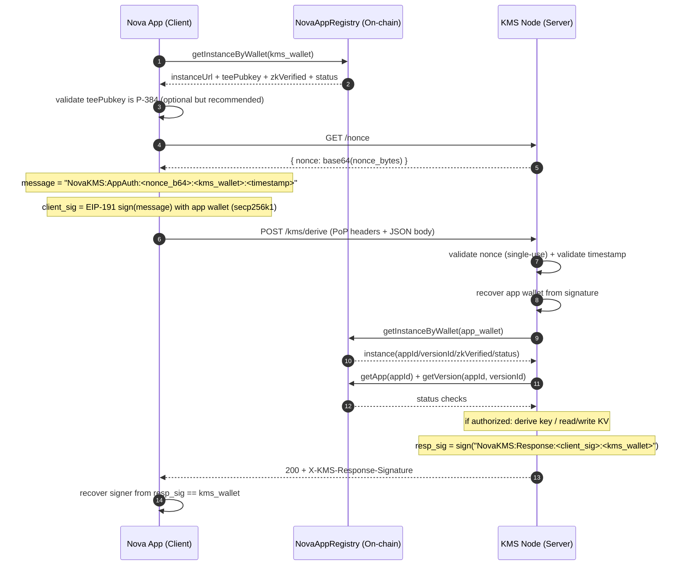

# Nova App ↔ KMS Node Connection & Authentication (Current Implementation)

This document describes the end-to-end flow for a **Nova App (client)** to connect to **Nova KMS (server)** and complete request authentication / mutual proof.

> Important: In the current implementation, **App→KMS business requests do NOT use an ECDH-encrypted session**. App→KMS uses **PoP (EIP-191 signatures) + on-chain authorization checks**.
>
> **ECDH (P-384) is currently used for the KMS↔KMS master secret sealed exchange** (see Appendix A).

---

## 0. Two Independent Keypairs (Must Be Clear Up Front)

Each enclave instance has two **fully independent** keypairs:

- **ETH wallet (secp256k1)**: on-chain field `teeWalletAddress`, used for signing (PoP / response mutual signature).
- **teePubkey (P-384 / secp384r1)**: on-chain field `teePubkey` (typically DER/SPKI), used for ECDH encryption (currently mainly for KMS↔KMS).

They are different keypairs on different curves:
- the wallet address is **NOT** derived from `teePubkey`
- `teePubkey` is **NOT** derived from the wallet

---

## 1. Discover Available KMS Nodes (Discovery)

### 1.1 Get the node list from a KMS node (HTTP /nodes)

If you already know any KMS node URL (bootstrap), you can call:

- `GET /nodes`

Server implementation: `/nodes` in `nova-kms/enclave/routes.py`.

Notes:
- The node list is sourced **only** from NovaAppRegistry (via PeerCache: `KMS_APP_ID → ACTIVE instances`)
- It does not depend on the KMSRegistry operator list
- It does not synchronously probe every peer inside this handler (uses cached status)

Response shape is roughly:

```json
{
  "operators": [
    {
      "operator": "0x...",
      "instance": {
        "instance_id": 1,
        "app_id": 43,
        "version_id": 1,
        "operator": "0x...",
        "instance_url": "https://...",
        "tee_wallet": "0x...",
        "zk_verified": true,
        "instance_status": {"value": 0, "name": "ACTIVE"},
        "registered_at": 0
      },
      "connection": {
        "in_peer_cache": true,
        "cached_status": "..."
      }
    }
  ],
  "count": 1
}
```

### 1.2 Query on-chain directly (recommended)

An app can also query `NovaAppRegistry` directly:

- use `KMS_APP_ID` to enumerate/query ACTIVE KMS instances
- use `instanceUrl` and `teeWalletAddress` as connection information
- use `teePubkey` as (optional) encryption/identity material

> The exact read APIs depend on your registry client; the KMS server internally uses `NovaRegistry.get_instance_by_wallet()`.

---

## 2. Fetch and Validate the KMS node teePubkey (P-384)

### 2.1 Fetch teePubkey

teePubkey lives in the on-chain RuntimeInstance record (field name typically `teePubkey` / `tee_pubkey`).

On the App side, you first identify the target node’s `teeWalletAddress` (the wallet used for PoP signing), then:

- call `NovaAppRegistry.getInstanceByWallet(teeWalletAddress)`
- read the returned `teePubkey` byte string

### 2.2 Validate teePubkey (encoding + curve)

The current implementation accepts two encodings:

- **DER/SPKI** (typically from Odyn `/v1/encryption/public_key`, first byte often `0x30`)
- **SEC1 uncompressed point**: `0x04 || x || y`, length **97 bytes** for P-384

Validation logic:
- Server: `validate_tee_pubkey()` / `parse_tee_pubkey()` in `nova-kms/enclave/secure_channel.py`
- Example client: `nova-examples/nova-kms-client/enclave/kms_identity.py`

---

## 3. App → KMS: Full PoP-authenticated Request Flow

### 3.1 Overview (Sequence)



---

## 4. Concrete Request Details (Aligned to Current Code)

### 4.1 Fetch Nonce

- `GET /nonce`
- returns: `{"nonce": "<base64>"}`
- the server applies a simple rate limit to `/nonce` (see `routes.py`)

### 4.2 App generates the PoP signature

The app must know the target node’s `kms_wallet` (i.e. the node’s on-chain `teeWalletAddress`). You can also obtain it from `GET /status` → `node.tee_wallet`.

Signature message (the server verifies this format exactly):

- `NovaKMS:AppAuth:<NonceBase64>:<KMS_Wallet>:<Timestamp>`

Where:
- `NonceBase64`: the `nonce` field from `GET /nonce` (base64 text, not raw bytes)
- `KMS_Wallet`: the destination node wallet (recipient binding; prevents reusing the signature for another node)
- `Timestamp`: unix seconds

Server-side logic in `nova-kms/enclave/auth.py`:
- nonce must be single-use and unexpired (it is consumed)
- timestamp must be within the allowed window (`POP_MAX_AGE_SECONDS`)
- the recovered wallet from the signature is the real identity (`X-App-Wallet` is an optional hint, but if provided must match)

### 4.3 App request headers

Required headers for App→KMS:

- `X-App-Signature`: `client_sig` (hex)
- `X-App-Nonce`: `nonce_b64`
- `X-App-Timestamp`: `timestamp`
- `X-App-Wallet`: (optional) explicit wallet address; if provided it must match the recovered signer

### 4.4 Example business request: POST /kms/derive

- `POST /kms/derive`

```json
{
  "path": "some_key_path",
  "context": "",
  "length": 32
}
```

If the client used PoP, the server adds a mutual response signature header:

- `X-KMS-Response-Signature`

The signed message is:

- `NovaKMS:Response:<client_sig>:<kms_wallet>`

Implementation: `_add_mutual_signature()` in `nova-kms/enclave/routes.py`.

---

## 5. Server-side Authorization Checks (On-chain checkpoints)

After authentication succeeds, the server authorizes the request via `AppAuthorizer.verify()`:

1. `getInstanceByWallet(app_wallet)`
2. instance must satisfy:
  - `status == ACTIVE`
  - `zkVerified == true`
3. `getApp(appId)`: App must be `ACTIVE`
4. `getVersion(appId, versionId)`: Version must be `ENROLLED` or `DEPRECATED`

Implementation: `nova-kms/enclave/auth.py`.

---

## 6. How the client verifies the mutual response signature (X-KMS-Response-Signature)

Example client implementation: `nova-examples/nova-kms-client/enclave/kms_identity.py`:

- construct `NovaKMS:Response:<client_sig>:<kms_wallet>`
- recover the signer address using EIP-191
- verify recovered == kms_wallet

---

## 7. Common Failure Cases (What you will see)

- `429`: `GET /nonce` rate limited
- `403`: missing PoP / expired nonce / stale timestamp / signature mismatch / on-chain authorization failed
- `503`: KMS master secret not initialized (e.g. `/kms/derive`) or service not ready

---

## Appendix A: KMS ↔ KMS ECDH (P-384) and sealed master secret exchange

This is not the App→KMS business request flow, but it is where the current implementation **actually uses ECDH (P-384)**.

### A.1 Purpose

- When a KMS node boots and detects active peers, it requests the cluster master secret from a peer
- The master secret is transmitted in sealed form using **ECDH + HKDF + AES-256-GCM**

### A.2 Request/Response

Request body (the requester provides its **ephemeral P-384 public key in DER**):

```json
{
  "type": "master_secret_request",
  "sender_wallet": "0xSender...",
  "ecdh_pubkey": "<P-384 DER hex>"
}
```

Response body (the peer returns a sealed envelope):

```json
{
  "status": "ok",
  "sealed": {
    "ephemeral_pubkey": "<P-384 DER hex>",
    "ciphertext": "<hex>",
    "nonce": "<hex>"
  }
}
```

Implementation:
- `nova-kms/enclave/kdf.py`: `seal_master_secret()` / `unseal_master_secret()`
- `nova-kms/enclave/secure_channel.py`: P-384 public key parsing/validation
- `nova-kms/enclave/sync_manager.py`: `request_master_secret()` and the pre-send `verify_peer_identity()` check

---

## Appendix B: Current implementation vs. a “full secure channel”

- Current:
  - App→KMS: PoP (secp256k1 signatures) + on-chain authorization + mutual response signature
  - KMS↔KMS: PoP + (P-384 ECDH for the master secret sealed exchange)

- Not implemented (if you expect “all application traffic is E2E encrypted”):
  - teePubkey-based end-to-end encryption of HTTP payloads / custom TLS trust root / true mTLS (RA-TLS)

If you want to upgrade App→KMS to “teePubkey-driven end-to-end encryption”, I can propose a minimal, implementable protocol and code changes while keeping PoP backward-compatible (but that would be a feature change and is out of scope for this document).
