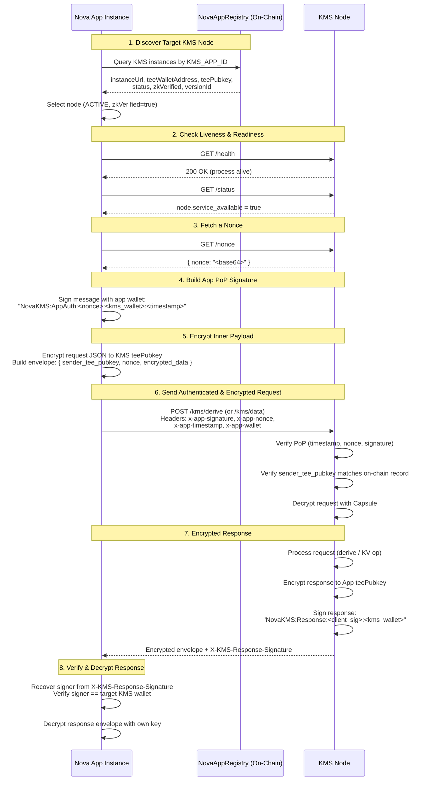

# Nova App To KMS Connection

This document describes how a Nova app instance talks to the current Rust KMS node.

## Connection Flow Overview


```mermaid
sequenceDiagram
    participant App as Nova App Instance
    participant Registry as NovaAppRegistry (On-Chain)
    participant KMS as KMS Node

    Note over App,Registry: 1. Discover Target KMS Node
    App->>Registry: Query KMS instances by KMS_APP_ID
    Registry-->>App: instanceUrl, teeWalletAddress, teePubkey,<br/>status, zkVerified, versionId
    App->>App: Select node (ACTIVE, zkVerified=true)

    Note over App,KMS: 2. Check Liveness & Readiness
    App->>KMS: GET /health
    KMS-->>App: 200 OK (process alive)
    App->>KMS: GET /status
    KMS-->>App: node.service_available = true

    Note over App,KMS: 3. Fetch a Nonce
    App->>KMS: GET /nonce
    KMS-->>App: { nonce: "<base64>" }

    Note over App,KMS: 4. Build App PoP Signature
    App->>App: Sign message with app wallet:<br/>"NovaKMS:AppAuth:<nonce>:<kms_wallet>:<timestamp>"

    Note over App,KMS: 5. Encrypt Inner Payload
    App->>App: Encrypt request JSON to KMS teePubkey<br/>Build envelope: { sender_tee_pubkey, nonce, encrypted_data }

    Note over App,KMS: 6. Send Authenticated & Encrypted Request
    App->>KMS: POST /kms/derive (or /kms/data)<br/>Headers: x-app-signature, x-app-nonce,<br/>x-app-timestamp, x-app-wallet
    KMS->>KMS: Verify PoP (timestamp, nonce, signature)
    KMS->>KMS: Verify sender_tee_pubkey matches on-chain record
    KMS->>KMS: Decrypt request with Capsule

    Note over App,KMS: 7. Encrypted Response
    KMS->>KMS: Process request (derive / KV op)
    KMS->>KMS: Encrypt response to App teePubkey
    KMS->>KMS: Sign response:<br/>"NovaKMS:Response:<client_sig>:<kms_wallet>"
    KMS-->>App: Encrypted envelope + X-KMS-Response-Signature

    Note over App: 8. Verify & Decrypt Response
    App->>App: Recover signer from X-KMS-Response-Signature<br/>Verify signer == target KMS wallet
    App->>App: Decrypt response envelope with own key
```

## 1. Discover The Target KMS Node

Use `NovaAppRegistry` as the source of truth.

For each candidate KMS node, obtain:

- `instanceUrl`
- `teeWalletAddress`
- `teePubkey`
- `status`
- `zkVerified`
- `versionId`

Choose a node that is:

- an ACTIVE instance
- `zkVerified=true`
- part of the KMS app identified by `KMS_APP_ID`

Use the registry values for first contact. Do not bootstrap trust from `/status`.

## 2. Check Liveness And Readiness

Two public endpoints are relevant:

- `GET /health`
  - process liveness only
- `GET /status`
  - inspect `node.service_available`

An app should treat `node.service_available=true` as the signal that `/kms/*` routes are ready.

## 3. Fetch A Nonce

Call:

```http
GET /nonce
```

Response:

```json
{
  "nonce": "<base64>"
}
```

The nonce is:

- random 16 bytes
- base64 encoded
- single-use
- subject to `NONCE_RATE_LIMIT_PER_MINUTE`

## 4. Build The App PoP Signature

Sign this exact message with the app instance wallet:

```text
NovaKMS:AppAuth:<nonce_b64>:<kms_wallet>:<timestamp>
```

Where:

- `nonce_b64` is the string returned by `/nonce`
- `kms_wallet` is the target node wallet from the registry
- `timestamp` is Unix seconds

The server checks:

- timestamp freshness against `POP_TIMEOUT_SECONDS`
- nonce format and single-use consumption
- signature recovery
- optional `x-app-wallet` equality with the recovered signer

## 5. Encrypt The Inner Payload

All app business requests use an encrypted envelope:

```json
{
  "sender_tee_pubkey": "<hex DER/SPKI>",
  "nonce": "<hex>",
  "encrypted_data": "<hex>"
}
```

How it is used:

1. the app encrypts the inner JSON to the KMS node `teePubkey`
2. the app includes its own `teePubkey` in `sender_tee_pubkey`
3. the KMS node verifies that `sender_tee_pubkey` matches the authenticated app instance's on-chain `teePubkey`
4. the KMS node decrypts with Capsule
5. the KMS node encrypts the response back to the app `teePubkey`

Plaintext JSON bodies are rejected.

## 6. Request Headers

When using normal app authentication, send:

- `x-app-signature`
- `x-app-nonce`
- `x-app-timestamp`
- `x-app-wallet` (optional)
- `content-type: application/json`

Local-only shortcut:

- if `IN_ENCLAVE=false`, the server also accepts `x-tee-wallet`
- this bypasses PoP, but it does not bypass encrypted request bodies

## 7. Derive API

Route:

```http
POST /kms/derive
```

Inner request payload:

```json
{
  "path": "wallet/root",
  "context": "session-a",
  "length": 32
}
```

Rules:

- `path` is required and non-empty
- `context` is optional
- `length` defaults to `32`
- `length` must be in `1..=1024`

Inner response payload:

```json
{
  "app_id": 49,
  "path": "wallet/root",
  "key": "<base64>",
  "length": 32
}
```

The response body is wrapped in the same encrypted envelope format.

## 8. KV APIs

### 8.1 List Keys

Route:

```http
GET /kms/data
```

Response inner payload:

```json
{
  "app_id": 49,
  "keys": ["a", "b"],
  "count": 2
}
```

### 8.2 Read One Key

Two equivalent forms:

```http
GET /kms/data?key=path/to/key
GET /kms/data/path/to/key
```

Response inner payload:

```json
{
  "app_id": 49,
  "key": "path/to/key",
  "value": "<base64 plaintext value>",
  "updated_at_ms": 1730000000000
}
```

### 8.3 Write One Key

Route:

```http
PUT /kms/data
```

Inner request payload:

```json
{
  "key": "path/to/key",
  "value": "<base64 plaintext value>",
  "ttl_ms": 60000
}
```

Rules:

- `key` is required
- `value` is required and must be base64
- `ttl_ms` is optional, `0` means no expiry
- plaintext value size must be `<= MAX_KV_VALUE_SIZE_BYTES`

Inner response payload:

```json
{
  "app_id": 49,
  "key": "path/to/key",
  "updated_at_ms": 1730000000000
}
```

### 8.4 Delete One Key

Route:

```http
DELETE /kms/data
```

Inner request payload:

```json
{
  "key": "path/to/key"
}
```

Inner response payload:

```json
{
  "app_id": 49,
  "key": "path/to/key",
  "deleted": true
}
```

Delete creates a tombstone in the namespace and participates in sync like any other record.

## 9. Mutual Response Signature

When the request used app PoP, the server adds:

```text
X-KMS-Response-Signature
```

The server signs:

```text
NovaKMS:Response:<client_signature>:<kms_wallet>
```

The app should recover the signer and verify that it equals the target KMS wallet.

If the request used the dev-only `x-tee-wallet` shortcut, there is no client signature to bind, so this response signature is not added.

## 10. Failure Modes

Typical responses:

- `400`
  - malformed envelope
  - invalid payload shape
  - missing required business fields
- `403`
  - missing or stale PoP
  - invalid or replayed nonce
  - wallet/header mismatch
  - on-chain authorization failure
  - `sender_tee_pubkey` mismatch
- `404`
  - missing key
- `429`
  - `/nonce` rate limit exceeded
- `503`
  - node not ready for `/kms/*`

## 11. Practical Notes

- `GET /status.node.tee_wallet` is useful for diagnostics, but the registry remains the trust root.
- `GET /health` returning `200` does not mean the node can serve `/kms/*`.
- All key and value material in business responses is inside the encrypted envelope. The outer HTTP body never carries it in plaintext.
