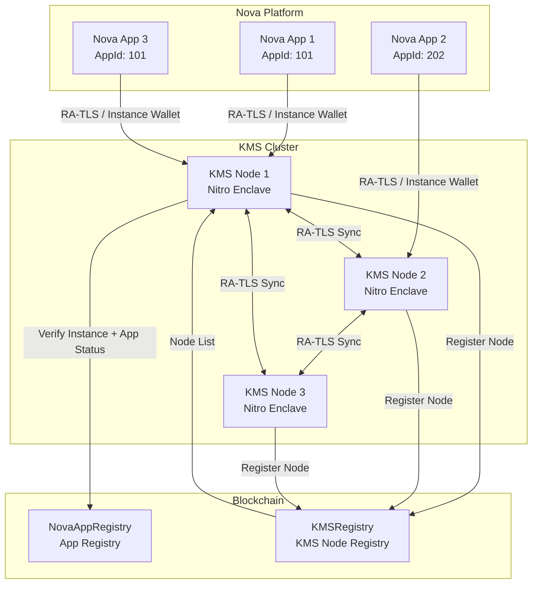
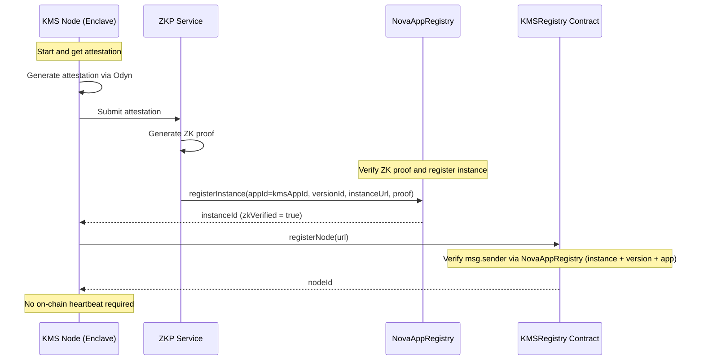
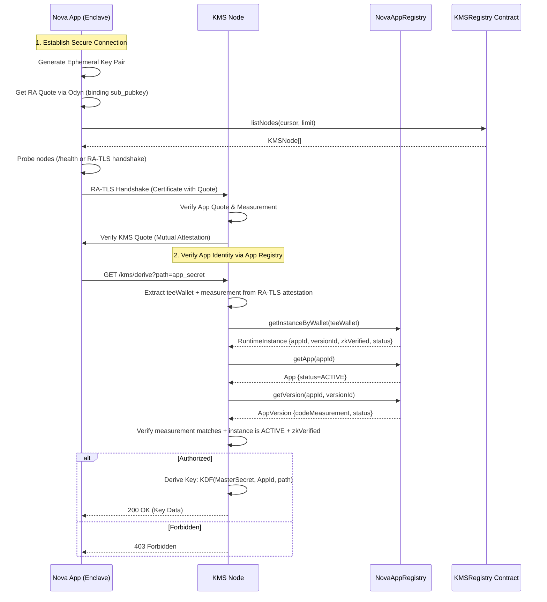
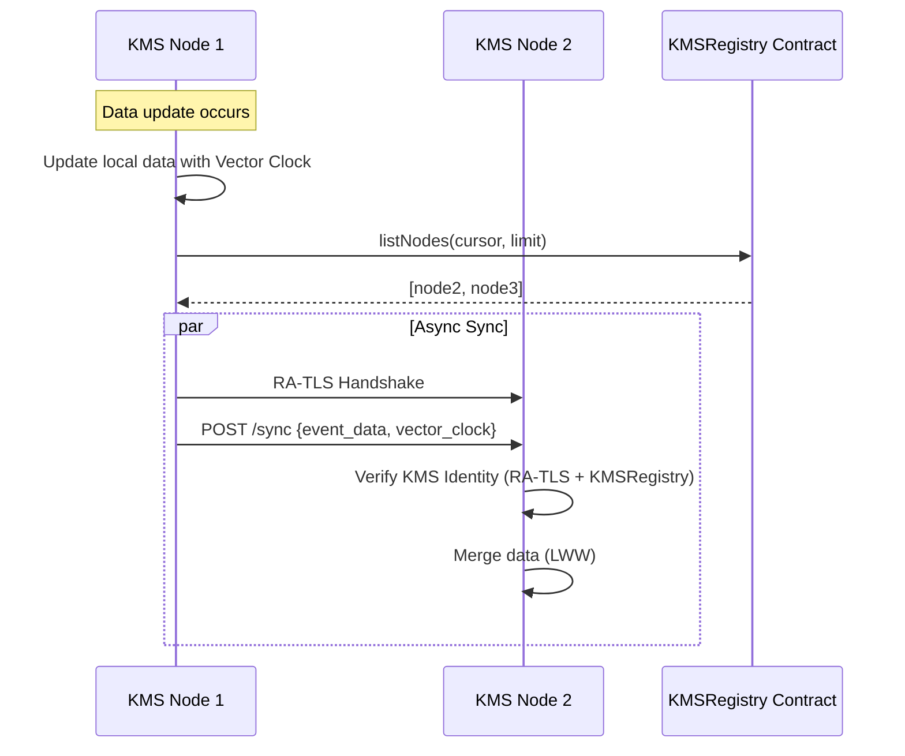

# Distributed Blockchain KMS Service - Architecture Design

## Overview

Design a distributed Key Management Service (KMS) running in AWS Nitro Enclave, deployed as a Nova Platform application and serving other Nova Platform applications. The KMS provides a **Key Derivation Service** and an **in-memory KV store**, with access controlled by **on-chain app registration** in the Nova App Registry. Applications are identified by their **App ID** (a `uint256` assigned by `NovaAppRegistry`), while code upgrades are managed as new **Versions** on-chain. KMS node membership is tracked on-chain by a dedicated **KMSRegistry** contract, but node health is determined by clients via live probes and RA-TLS handshakes. Communication is secured via **RA-TLS** (Remote Attestation TLS).



---

## 1. System Components

### 1.1 KMS Enclave Application

A Python/Flask application running inside AWS Nitro Enclave, packaged and deployed on the Nova Platform. It serves other Nova apps and enforces access control using on-chain app registration data.

**Core Features:**

| Feature | Description |
|---------|-------------|
| In-memory KV Store | `dict[AppId, dict]` - partitioned by application identity, **non-persistent** |
| **Key Derivation (KDF)** | Derive application-specific keys from cluster-wide master secret |
| **CA / Cert Signing** | Issue TLS certificates for apps rooted in KMS trust anchor |
| Request Verification | Verify App identity via NovaAppRegistry (App -> Version -> Instance) |
| RA-TLS | Mutual Remote Attestation TLS for all client and node communication |
| Health Probing | Client-side probes and RA-TLS handshakes determine liveness |
| Status Monitoring | `/status` endpoint showing KMS cluster health |

**Odyn API Usage:**

```python
# Get KMS node identity on startup
eth_address = odyn.eth_address()      # KMS Ethereum address
public_key = odyn.get_public_key()    # KMS P-384 public key
attestation = odyn.get_attestation()  # KMS attestation document
```

### 1.2 On-chain Contracts

#### 1.2.1 NovaAppRegistry (App Registry)

The KMS relies on **NovaAppRegistry** as the source of truth for app identity, code measurement, and runtime instances. The registry is organized as **App -> Version -> Instance**:

- **App**: `appId`, owner, optional `dappContract`, status
- **Version**: `versionId`, `codeMeasurement`, status
- **Instance**: `teeWalletAddress`, `teePubkey`, `instanceUrl`, `zkVerified`, status

Minimal interface used by KMS (aligned with `NovaAppRegistry.sol`):

```solidity
// SPDX-License-Identifier: Apache-2.0
pragma solidity ^0.8.33;

interface INovaAppRegistry {
    enum AppStatus { ACTIVE, INACTIVE, REVOKED }
    enum VersionStatus { ENROLLED, DEPRECATED, REVOKED }
    enum InstanceStatus { ACTIVE, STOPPED, FAILED }

    struct App {
        uint256 appId;
        address owner;
        bytes32 teeArch;
        address dappContract;
        string metadataUri;
        uint256 latestVersionId;
        uint256 createdAt;
        AppStatus status;
    }

    struct AppVersion {
        uint256 versionId;
        string versionName;
        bytes32 codeMeasurement;
        string imageUri;
        string auditUrl;
        string auditHash;
        string githubRunId;
        VersionStatus status;
        uint256 enrolledAt;
        address enrolledBy;
    }

    struct RuntimeInstance {
        uint256 instanceId;
        uint256 appId;
        uint256 versionId;
        address operator;
        string instanceUrl;
        bytes teePubkey;
        address teeWalletAddress;
        bool zkVerified;
        InstanceStatus status;
        uint256 registeredAt;
    }

    function getApp(uint256 appId) external view returns (App memory);
    function getVersion(uint256 appId, uint256 versionId) external view returns (AppVersion memory);
    function getInstance(uint256 instanceId) external view returns (RuntimeInstance memory);
    function getInstanceByWallet(address teeWalletAddress) external view returns (RuntimeInstance memory);
    function getInstancesForVersion(uint256 appId, uint256 versionId) external view returns (uint256[] memory);
}
```

Operational note: NovaAppRegistry is **UUPS upgradeable**; always interact with the **proxy address**.

> Note: `appId` is a **uint256 assigned by NovaAppRegistry**, not a contract address. If an app uses an on-chain contract, it is referenced via the optional `dappContract` field.

#### 1.2.2 KMSRegistry (KMS Node Registry)

A standalone smart contract for managing KMS node registration.

```solidity
// SPDX-License-Identifier: Apache-2.0
pragma solidity ^0.8.33;

import {INovaAppRegistry} from "./interfaces/INovaAppRegistry.sol";

/**
 * @title KMSRegistry
 * @notice Registry for KMS nodes in the Nova platform
 * @dev KMS nodes must be registered as NovaAppRegistry instances under the kmsAppId.
 */
contract KMSRegistry {
    struct KMSNode {
        uint256 nodeId;
        address teeWalletAddress;
        bytes teePubkey;
        string nodeUrl;
        bool isActive;
    }

    INovaAppRegistry public novaAppRegistry;
    uint256 public kmsAppId;
    mapping(uint256 => KMSNode) public nodes;
    mapping(address => uint256) public nodeIdByWallet;
    uint256 public nextNodeId = 1;

    event NodeRegistered(uint256 indexed nodeId, address indexed teeWallet, string nodeUrl);
    event NodeDeactivated(uint256 indexed nodeId);

    constructor(address _novaAppRegistry, uint256 _kmsAppId) {
        novaAppRegistry = INovaAppRegistry(_novaAppRegistry);
        kmsAppId = _kmsAppId;
    }

    function registerNode(string calldata nodeUrl) external returns (uint256 nodeId) {
        // 1) Lookup instance by tee wallet (msg.sender)
        // 2) Require instance.appId == kmsAppId
        // 3) Require instance.status == ACTIVE and instance.zkVerified == true
        // 4) Require app.status == ACTIVE and version.status in {ENROLLED, DEPRECATED}
        // 5) Record node (teePubkey from instance, nodeUrl)
    }

    function deactivateNode(uint256 nodeId) external {
        // Registry admin or node wallet can deactivate (emergency or clean shutdown).
    }

    function getNode(uint256 nodeId) external view returns (KMSNode memory);
    function getNodeByWallet(address teeWalletAddress) external view returns (KMSNode memory);

    function listNodes(uint256 cursor, uint256 limit) external view returns (KMSNode[] memory, uint256 nextCursor);
}
```

Interaction summary:
- KMSRegistry is read-only to NovaAppRegistry and uses `getInstanceByWallet`, `getApp`, and `getVersion` to validate KMS nodes.
- A KMS node is considered healthy if it is `isActive` on-chain and passes client-side liveness probes.
- Node enumeration is paginated to avoid unbounded loops. Off-chain clients can filter for health using probes.
- Assumption: the `msg.sender` for KMSRegistry transactions is the KMS node TEE wallet registered in NovaAppRegistry. If KMS nodes cannot sign transactions directly, add a meta-tx relayer layer and verify signed intent in KMSRegistry.

---

## 2. Core Flows

### 2.1 KMS Node Registration Flow



> [!IMPORTANT]
> **Security Mechanism**: `registerNode` only succeeds if the node is a **zkVerified, ACTIVE instance** of the KMS app in NovaAppRegistry. This prevents unverified programs from registering as KMS nodes.

### 2.2 App Request Flow (RA-TLS + App Registry)



### 2.3 App Authorization Logic (Instance + App Registry)

```python
async def verify_app_request(request: KMSRequest, client_attestation: Attestation) -> tuple[bool, str | None]:
    """
    Verify that request comes from a valid and authorized Nova application.
    
    Steps:
    1. Extract Code Measurement (PCRs) and TEE wallet from RA-TLS Client Attestation.
    2. Query NovaAppRegistry to map wallet -> instance (appId, versionId).
    3. Verify instance is ACTIVE and zkVerified.
    4. Fetch App + Version to ensure:
       - App status is ACTIVE.
       - Version status is ENROLLED/DEPRECATED.
       - Code measurement matches the enrolled version.
    """
    measurement = client_attestation.get_measurement()
    tee_wallet = client_attestation.get_extension("TEE_WALLET")
    
    instance = await nova_app_registry.get_instance_by_wallet(tee_wallet)
    if instance.instance_id == 0:
        return False, "Instance not found"
    if not instance.zk_verified or instance.status != "ACTIVE":
        return False, "Instance not verified or inactive"
    
    app = await nova_app_registry.get_app(instance.app_id)
    version = await nova_app_registry.get_version(instance.app_id, instance.version_id)
    
    if app.status != "ACTIVE":
        return False, "App not active"
    if version.status not in {"ENROLLED", "DEPRECATED"}:
        return False, "Version not allowed"
    if version.code_measurement != measurement:
        return False, "Measurement mismatch"
    
    # 5. Success - Proceed with KDF or KV operation, using app_id as namespace
    return True, None
```

### 2.4 Data Synchronization Flow (RA-TLS Secured)

KMS nodes synchronize data over secure mutual RA-TLS channels.



---

## 3. API Design

### 3.1 KMS Node API

| Endpoint | Method | Description | Auth |
|----------|--------|-------------|------|
| `/health` | GET | Health check | None |
| `/status` | GET | KMS node + cluster view | None |
| `/kms/derive` | GET | **Derive application key** (KDF) | RA-TLS + NovaAppRegistry verification |
| `/kms/sign_cert`| POST | **Sign certificate** (CA) | RA-TLS + NovaAppRegistry verification |
| `/kms/data` | GET | Get/Put/Delete KV data | RA-TLS + NovaAppRegistry verification |
| `/sync` | POST | Receive sync event from other KMS nodes | RA-TLS (KMS Node) |
| `/nodes` | GET | Get list of nodes (paginated) | None |

### 3.2 Status Endpoint Response

The `/status` endpoint returns a merged view of local health and on-chain cluster state. Cluster health is derived from client-side probes plus on-chain `isActive` flags.

```json
{
    "node": {
        "node_id": 7,
        "tee_wallet": "0x1234...",
        "node_url": "https://kms-7.nova",
        "is_active": true,
        "last_probe_ms": 1738855800
    },
    "cluster": {
        "kms_app_id": 9001,
        "registry_address": "0xabc...",
        "total_nodes": 12,
        "healthy_nodes": 10
    }
}
```

### 3.3 Request Format (RA-TLS Secured)
Handshake and encryption are handled by RA-TLS. Payload format is simple JSON.

> Note: The KMS **does not trust client-provided App IDs**. It derives `appId` from the attested TEE wallet via NovaAppRegistry. If a header is provided, it must match.

**GET /kms/derive**
```json
{
  "path": "app_disk_encryption",
  "context": "v1",
  "nonce": "random-uuid"
}
```

**POST /kms/sign_cert**
```json
{
  "csr": "base64_encoded_csr",
  "usage": "https_server"
}
```

### 3.4 Key Derivation (KDF) Implementation

KMS uses a Cluster Master Secret (held in TEE memory) to derive keys using HKDF.

```python
def derive_app_key(master_secret: bytes, app_id: str, path: str) -> bytes:
    """Derive a stable, unique key for an app."""
    return HKDF(
        algorithm=hashes.SHA256(),
        length=32,
        salt=app_id.encode(),
        info=path.encode()
    ).derive(master_secret)
```

---

## 4. Data Synchronization Protocol

### 4.1 Membership and Sync Strategy

- **Membership source**: nodes query `KMSRegistry.listNodes(cursor, limit)` and filter for healthy peers using probes.
- **Anti-entropy**: periodic push/pull of recent updates (delta sync) to peers.
- **Catch-up**: if a node is far behind (vector clock gap exceeds threshold), request a **snapshot** from a healthy peer.
- **Security**: all sync messages use mutual RA-TLS and validate the sender is a healthy, registered KMS node.
- **Backpressure**: rate-limit sync and snapshot requests to avoid amplification during spikes.

### 4.2 Vector Clock Based Sync

Uses Vector Clock for eventual consistency to avoid conflicts.

```python
class VectorClock:
    """Vector clock for distributed consistency."""
    
    def __init__(self, node_id: str):
        self.node_id = node_id
        self.clock: dict[str, int] = {}
    
    def increment(self):
        self.clock[self.node_id] = self.clock.get(self.node_id, 0) + 1
    
    def merge(self, other: "VectorClock"):
        for node_id, count in other.clock.items():
            self.clock[node_id] = max(self.clock.get(node_id, 0), count)
    
    def is_concurrent(self, other: "VectorClock") -> bool:
        """Check if two clocks are concurrent (neither happened-before)."""
        self_greater = any(
            self.clock.get(k, 0) > other.clock.get(k, 0) 
            for k in self.clock
        )
        other_greater = any(
            other.clock.get(k, 0) > self.clock.get(k, 0) 
            for k in other.clock
        )
        return self_greater and other_greater
```

### 4.3 Conflict Resolution

For concurrent writes, uses **Last-Writer-Wins (LWW)** strategy based on timestamp.

### 4.4 Internal Data Storage (Non-Persistent)

The KMS **does not persist data to disk**. All state lives in enclave memory and is rebuilt from peers after restart.

**Storage Model (per App ID namespace):**

```python
class DataRecord:
    key: str
    value: bytes              # optional: encrypted with per-app data key
    version: VectorClock
    updated_at_ms: int
    tombstone: bool
    ttl_ms: int | None
```

**Notes:**
- **Non-persistent**: no filesystem writes; no local database.
- **Rehydration**: on startup, node performs sync and/or snapshot to rebuild state.
- **Limits**: per-app size quota + LRU eviction; TTL expiration for stale records.
- **Security**: values may be encrypted with `KDF(master_secret, app_id, "data_key")` to reduce in-memory exposure.

---

## 5. Security Considerations

### 5.1 Threat Model

| Threat | Mitigation |
|--------|------------|
| Unauthorized data access | RA-TLS Client Attestation + NovaAppRegistry instance verification |
| App Code Upgrade Leak | App/Version hierarchy allows owners to rotate approved measurements |
| Man-in-the-middle | RA-TLS (Mutual Attestation) |
| Replay attack | RA-TLS Session management + Nonces |
| Node impersonation during sync | Mutual RA-TLS between KMS nodes |

### 5.2 Access Control Matrix (Instance Based)

| Actor | Derive Key | GET/PUT Data | SIGN CERT | SYNC |
|-------|-----|-----|--------|------|
| Authorized App Instance (zkVerified + ACTIVE) | ✅ | ✅ | ✅ | ❌ |
| Unregistered / Inactive Instance | ❌ | ❌ | ❌ | ❌ |
| Registered KMS node | ❌ | ❌ | ❌ | ✅ |

### 5.3 Sync Request Verification

```python
async def verify_sync_request(request: SyncRequest, client_attestation: Attestation) -> bool:
    """Verify that sync request comes from a valid KMS node."""
    # 1. Extract KMS Node wallet from RA-TLS Client Attestation
    tee_wallet = client_attestation.get_extension("TEE_WALLET")
    
    # 2. Check if it's a registered node and passes a liveness probe
    node = await kms_registry.getNodeByWallet(tee_wallet)
    return node.isActive and await probe_node(node.nodeUrl)
```

---

## 6. Project Structure

```
dkms/
├── enclave/
│   ├── app.py                 # Main Flask application + /status endpoint
│   ├── odyn.py                # Odyn API wrapper
│   ├── data_store.py          # In-memory KV store with vector clock
│   ├── sync_manager.py        # Data synchronization logic (RA-TLS)
│   ├── probe.py               # Liveness probing helpers
│   ├── auth.py                # RA-TLS Attestation verification
│   ├── kdf.py                 # Key Derivation Function utilities
│   ├── nova_registry.py       # NovaAppRegistry contract interaction
│   ├── kms_registry.py        # KMS Registry contract interaction
│   ├── requirements.txt
│   └── Dockerfile
├── contracts/
│   └── KMSRegistry.sol        # KMS node registry contract
├── docs/
│   └── architecture.md        # This document
└── README.md
```

---

## 7. Deployment

### 7.1 Prerequisites
1. Nova Platform account
2. NovaAppRegistry proxy address (deployed by Nova Platform)
3. KMSRegistry contract deployed (configured with NovaAppRegistry + kmsAppId)
4. KMS app created in Nova Platform (appId assigned)

### 7.2 Deployment Steps

1. **Deploy KMSRegistry contract**
   ```bash
   cd contracts
   forge script script/DeployKMSRegistry.s.sol --broadcast
   ```

2. **Create KMS application**
   - Create new app in Nova Platform
   - Record `kmsAppId` assigned by NovaAppRegistry
   - Enable ZK verification

3. **Trigger build and deploy**
   - Trigger GitHub Actions build
   - Deploy to Nitro Enclave

4. **Verify node registration**
   - ZKP service automatically generates proof
   - NovaAppRegistry verifies `registerInstance(...)` (zkVerified = true)
   - KMS node calls `registerNode` to complete registration

---

## Next Steps

1. Implement KMSRegistry smart contract
2. Implement KMS enclave application core logic (RA-TLS + KDF)
3. Implement data synchronization protocol over RA-TLS
4. Deploy to test environment for verification
