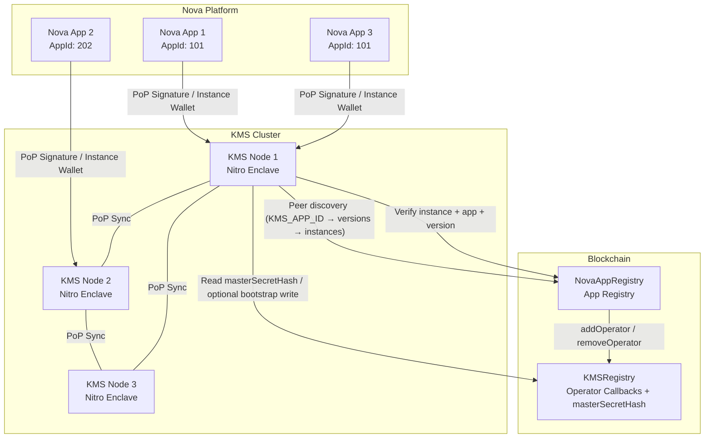

# Distributed Blockchain KMS Service - Architecture Design

## Overview

Design a distributed Key Management Service (KMS) running in AWS Nitro Enclave, deployed as a Nova Platform application and serving other Nova Platform applications. The KMS provides a **Key Derivation Service** and an **in-memory KV store**, with access controlled by **on-chain app registration** in the Nova App Registry. Applications are identified by their **App ID** (a `uint256` assigned by `NovaAppRegistry`), while code upgrades are managed as new **Versions** on-chain.

Peer discovery in the current implementation is sourced directly from **NovaAppRegistry** (via an in-enclave `PeerCache`):

- `KMS_APP_ID` → ENROLLED versions → ACTIVE instances

The repository also includes a dedicated **KMSRegistry** contract. In addition to receiving operator callbacks from `NovaAppRegistry`, it stores a cluster-wide `masterSecretHash`. During cluster bootstrap, a KMS node may submit a one-time on-chain transaction to set `masterSecretHash` when it is unset.

Request authentication uses **lightweight Proof-of-Possession (PoP) signatures** bound to on-chain identities.



---

## 1. System Components

### 1.1 KMS Enclave Application

A Python/FastAPI application running inside AWS Nitro Enclave, packaged and deployed on the Nova Platform. It serves other Nova apps and enforces access control using on-chain app registration data.

**Core Features:**

| Feature | Description |
|---------|-------------|
| In-memory KV Store | `dict[AppId, dict]` - partitioned by application identity, **non-persistent** |
| **Key Derivation (KDF)** | Derive application-specific keys from cluster-wide master secret |
| Request Verification | Verify App identity via NovaAppRegistry (App -> Version -> Instance) |
| Authentication | PoP signatures bound to on-chain identities |
| Health / Connectivity | KMS caches peers from NovaAppRegistry (see `PeerCache`); clients may probe liveness out-of-band |
| Status Monitoring | `/status` endpoint showing KMS cluster health |

**Enclave Key Architecture:**

Every Nova Platform enclave (including KMS nodes) has **two independent keypairs** on different elliptic curves:

| Keypair | Curve | On-chain Field | Purpose |
|---------|-------|----------------|---------|
| **ETH wallet** | secp256k1 | `teeWalletAddress` | PoP message signing (EIP-191) |
| **teePubkey** | P-384 (secp384r1) | `teePubkey` (DER/SPKI) | ECDH encryption (master secret exchange) |

These keypairs are **completely independent**:
- The wallet address is **NOT** derived from `teePubkey`.
- `teePubkey` is **NOT** derived from the wallet.
- `teePubkey` is used exclusively for ECDH-based encryption between enclaves.
- The ETH wallet is used exclusively for signing PoP/response messages.

**Odyn API Usage:**

```python
# Get KMS node identity on startup (secp256k1 wallet)
eth_address = odyn.eth_address()       # KMS Ethereum address for signing
random_bytes = odyn.get_random_bytes() # Hardware RNG
sig_res = odyn.sign_message(msg)       # EIP-191 signing for PoP

# P-384 encryption (teePubkey)
pub = odyn.get_encryption_public_key()             # includes public_key_der (hex)
enc = odyn.encrypt("plaintext", peer_pubkey_hex)
plaintext = odyn.decrypt(enc["nonce"], peer_pubkey_hex, enc["encrypted_data"])
```

### 1.2 On-chain Contracts

#### 1.2.1 NovaAppRegistry (App Registry)

The KMS relies on **NovaAppRegistry** as the source of truth for app identity, code measurement, and runtime instances. The registry is organized as **App -> Version -> Instance**:

- **App**: `appId`, owner, optional `dappContract`, status
- **Version**: `versionId`, `codeMeasurement`, status
- **Instance**: `teeWalletAddress`, `teePubkey`, `instanceUrl`, `zkVerified`, status

Minimal interface used by KMS (aligned with `NovaAppRegistry.sol`):

```solidity
// SPDX-License-Identifier: Apache-2.0
pragma solidity ^0.8.33;

interface INovaAppRegistry {
    enum AppStatus { ACTIVE, INACTIVE, REVOKED }
    enum VersionStatus { ENROLLED, DEPRECATED, REVOKED }
    enum InstanceStatus { ACTIVE, STOPPED, FAILED }

    struct App {
        uint256 appId;
        address owner;
        bytes32 teeArch;
        address dappContract;
        string metadataUri;
        uint256 latestVersionId;
        uint256 createdAt;
        AppStatus status;
    }

    struct AppVersion {
        uint256 versionId;
        string versionName;
        bytes32 codeMeasurement;
        string imageUri;
        string auditUrl;
        string auditHash;
        string githubRunId;
        VersionStatus status;
        uint256 enrolledAt;
        address enrolledBy;
    }

    struct RuntimeInstance {
        uint256 instanceId;
        uint256 appId;
        uint256 versionId;
        address operator;
        string instanceUrl;
        bytes teePubkey;
        address teeWalletAddress;
        bool zkVerified;
        InstanceStatus status;
        uint256 registeredAt;
    }

    function getApp(uint256 appId) external view returns (App memory);
    function getVersion(uint256 appId, uint256 versionId) external view returns (AppVersion memory);
    function getInstance(uint256 instanceId) external view returns (RuntimeInstance memory);
    function getInstanceByWallet(address teeWalletAddress) external view returns (RuntimeInstance memory);
    function getInstancesForVersion(uint256 appId, uint256 versionId) external view returns (uint256[] memory);
}
```

Operational note: NovaAppRegistry is **UUPS upgradeable**; always interact with the **proxy address**.

> [!NOTE]
> `appId` is a **uint256 assigned by NovaAppRegistry**, not a contract address. If an app uses an on-chain contract, it is referenced via the optional `dappContract` field.

#### 1.2.2 KMSRegistry (Operator List)

A standalone smart contract implementing **`INovaAppInterface`** that maintains an operator set managed by `NovaAppRegistry` callbacks, and stores a cluster-wide `masterSecretHash`.

**INovaAppInterface Integration:**

```solidity
interface INovaAppInterface {
    function addOperator(address teeWalletAddress, uint256 appId, uint256 versionId, uint256 instanceId) external;
    function removeOperator(address teeWalletAddress, uint256 appId, uint256 versionId, uint256 instanceId) external;
    function setNovaAppRegistry(address registry) external;
    function novaAppRegistry() external view returns (address);
}
```

**Operator Lifecycle:**

1. **`addOperator`** — Called by NovaAppRegistry when a TEE instance registers for the KMS app. Adds the wallet to the operator set. Validates `appId == kmsAppId`. Idempotent.
2. **`removeOperator`** — Called by NovaAppRegistry when instance stops/fails. Removes from operator set using O(1) swap-and-pop. Idempotent.

**Master Secret Hash (bootstrap mutex):**

- `masterSecretHash` is `bytes32(keccak256(masterSecret))`.
- `setMasterSecretHash(bytes32)` can be called once when the value is unset.
    The contract validates that the caller is an ACTIVE instance of the KMS app and that its version is ENROLLED.
- `resetMasterSecretHash()` is owner-only.

```solidity
pragma solidity ^0.8.33;

/// Simplified interface for the on-chain KMSRegistry contract.
interface IKMSRegistry {
    // Operator callbacks (invoked by NovaAppRegistry)
    function addOperator(address teeWalletAddress, uint256 appId, uint256 versionId, uint256 instanceId) external;
    function removeOperator(address teeWalletAddress, uint256 appId, uint256 versionId, uint256 instanceId) external;

    // Operator views
    function isOperator(address account) external view returns (bool);
    function getOperators() external view returns (address[] memory);

    // Cluster master-secret coordination
    function masterSecretHash() external view returns (bytes32);
    function setMasterSecretHash(bytes32 newHash) external;
    function resetMasterSecretHash() external;
}
```

Interaction summary:
- **NovaAppRegistry → KMSRegistry**: `addOperator`/`removeOperator` callbacks manage the operator set. The `dappContract` field of the KMS app on NovaAppRegistry must point to the KMSRegistry address.
- **KMSRegistry** validates eligibility for `setMasterSecretHash()` by reading required fields from NovaAppRegistry.
- **Peer discovery in the KMS service implementation** is sourced from NovaAppRegistry directly (see `/nodes` and `PeerCache`). The operator list in KMSRegistry is not used for runtime peer discovery.

---

## 2. Core Flows

### 2.1 KMS Node Registration Flow

See [KMS Core Workflows & Security Architecture - Section 2: KMS Node Join & Enrollment](./kms-core-workflows.md#2-kms-node-join--enrollment).

### 2.2 App Request Flow

See [KMS Core Workflows & Security Architecture - Section 5: Nova App Access to KMS](./kms-core-workflows.md#5-nova-app-access-to-kms-mutual-pop).

### 2.3 App Authorization Logic (Instance + App Registry)

```python
def verify_app_request(identity: ClientIdentity) -> tuple[bool, str | None]:
    """Verify that a request comes from a valid and authorized Nova application.

    The current implementation authorizes based on NovaAppRegistry state:
    - Instance is ACTIVE and zkVerified
    - App status is ACTIVE
    - Version status is ENROLLED

    (No code-measurement comparison is performed in this layer.)
    """
    auth = AppAuthorizer(registry=nova_app_registry)
    result = auth.verify(identity)
    return (result.authorized, None if result.authorized else result.reason)
```

### 2.4 Data Synchronization Flow

See [KMS Core Workflows & Security Architecture - Section 4: Inter-Node Mutual Authentication](./kms-core-workflows.md#4-inter-node-mutual-authentication-lightweight-pop).

---

## 3. API Design

### 3.1 KMS Node API

| Endpoint | Method | Description | Auth |
|----------|--------|-------------|------|
| `/health` | GET | Health check | None |
| `/status` | GET | KMS node + cluster view | None |
| `/nonce` | GET | Issue one-time PoP nonce | None |
| `/kms/derive` | POST | **Derive application key** (KDF) | App PoP + NovaAppRegistry verification |
| `/kms/data` | GET/PUT/DELETE | KV data operations | App PoP + NovaAppRegistry verification |
| `/kms/data/{key}` | GET | Read KV value | App PoP + NovaAppRegistry verification |
| `/sync` | POST | Receive sync event from other KMS nodes | KMS peer PoP + optional HMAC |
| `/nodes` | GET | List KMS instances (from PeerCache / NovaAppRegistry) | None |

### 3.2 Status Endpoint Response

The `/status` endpoint returns a merged view of local health and cluster overview. The cluster view uses the in-enclave peer cache (NovaAppRegistry-sourced) for instance count.

```json
{
    "node": {
        "tee_wallet": "0x1234...",
        "node_url": "https://kms-7.nova",
        "is_operator": true,
        "master_secret_initialized": true
    },
    "cluster": {
        "kms_app_id": 9001,
        "registry_address": "0xabc...",
        "total_instances": 12
    }
}
```

### 3.3 Request Format (PoP Secured)
Payload format is simple JSON.

> [!IMPORTANT]
> The KMS **does not trust client-provided App IDs**. It derives `appId`
> from the PoP-identified TEE wallet via NovaAppRegistry. If a header is provided,
> it must match.
>
> **No trusted middleboxes**: the enclave application does not trust any proxy
> or TLS terminator. In production, the caller must provide PoP signature
> headers that the enclave verifies directly against on-chain registered
> identities.

**POST /kms/derive**
```json
{
  "path": "app_disk_encryption",
  "context": "v1",
  "nonce": "random-uuid"
}
```


### 3.4 Key Derivation (KDF) Implementation

KMS uses a Cluster Master Secret (held in TEE memory) to derive keys using HKDF.

```python
def derive_app_key(master_secret: bytes, app_id: str, path: str) -> bytes:
    """Derive a stable, unique key for an app."""
    return HKDF(
        algorithm=hashes.SHA256(),
        length=32,
        salt=app_id.encode(),
        info=path.encode()
    ).derive(master_secret)
```

---

## 4. Data Synchronization Protocol

### 4.1 Membership and Sync Strategy

- **Membership source**: nodes discover peers via NovaAppRegistry (`KMS_APP_ID` → ENROLLED versions → ACTIVE instances), cached in `PeerCache`.
- **Anti-entropy**: periodic push/pull of recent updates (delta sync) to peers.
- **Catch-up**: if a node is far behind (vector clock gap exceeds threshold), request a **snapshot** from a healthy peer.
- **Security**: sync messages are authenticated with PoP and authorize the sender as an ACTIVE + zkVerified instance of the KMS app with an ENROLLED version.
- **Backpressure**: rate-limit sync and snapshot requests to avoid amplification during spikes.

### 4.2 Vector Clock Based Sync

Uses Vector Clock for eventual consistency to avoid conflicts.

```python
class VectorClock:
    """Vector clock for distributed consistency."""
    
    def __init__(self, node_id: str):
        self.node_id = node_id
        self.clock: dict[str, int] = {}
    
    def increment(self):
        self.clock[self.node_id] = self.clock.get(self.node_id, 0) + 1
    
    def merge(self, other: "VectorClock"):
        for node_id, count in other.clock.items():
            self.clock[node_id] = max(self.clock.get(node_id, 0), count)
    
    def is_concurrent(self, other: "VectorClock") -> bool:
        """Check if two clocks are concurrent (neither happened-before)."""
        self_greater = any(
            self.clock.get(k, 0) > other.clock.get(k, 0) 
            for k in self.clock
        )
        other_greater = any(
            other.clock.get(k, 0) > self.clock.get(k, 0) 
            for k in other.clock
        )
        return self_greater and other_greater
```

### 4.3 Conflict Resolution

For concurrent writes, uses **Last-Writer-Wins (LWW)** strategy based on timestamp.

### 4.4 Internal Data Storage (Non-Persistent)

The KMS **does not persist data to disk**. All state lives in enclave memory and is rebuilt from peers after restart.

**Storage Model (per App ID namespace):**

```python
class DataRecord:
    key: str
    value: bytes              # optionally encrypted with per-app data key
    version: VectorClock
    updated_at_ms: int
    tombstone: bool
    ttl_ms: int | None
```

**Notes:**
- **Non-persistent**: no filesystem writes; no local database.
- **Rehydration**: on startup, node performs sync and/or snapshot to rebuild state.
- **Limits**: per-app size quota + LRU eviction; TTL expiration for stale records.
- **Security**: values are stored encrypted-at-rest using a per-app data key (AES-GCM). In production (`IN_ENCLAVE=true`), plaintext fallback is disabled; in local development, plaintext fallback may be enabled for convenience.

---

## 5. Security Considerations

### 5.1 Threat Model

| Threat | Mitigation |
|--------|------------|
| Unauthorized data access | PoP + NovaAppRegistry instance verification |
| App Code Upgrade Leak | App/Version hierarchy allows owners to rotate approved measurements |
| Man-in-the-middle | TLS + in-app PoP verification (no trusted proxies) |
| Replay attack | PoP nonce + timestamp window (configurable) |
| Node impersonation during sync | PoP + NovaAppRegistry authorization (KMS app, ACTIVE+zkVerified, ENROLLED) + (if encrypted) sender_tee_pubkey checked against registered teePubkey before decryption |

### 5.2 Access Control Matrix (Instance Based)

| Actor | Derive Key | GET/PUT Data | SYNC |
|-------|-----|-----|------|
| Authorized App Instance (zkVerified + ACTIVE) | ✅ | ✅ | ❌ |
| Unregistered / Inactive Instance | ❌ | ❌ | ❌ |
| Registered KMS node | ❌ | ❌ | ✅ |

### 5.3 Sync Request Verification

```python
def verify_sync_request(identity: ClientIdentity) -> bool:
        """Verify that a sync request comes from a valid KMS peer.

        The implementation verifies:
        - PoP timestamp freshness + nonce single-use
        - PoP message signature (NovaKMS:Auth:...)
        - Sender is authorized as a KMS instance via NovaAppRegistry (AppAuthorizer(require_app_id=KMS_APP_ID))
        - Optional HMAC (x-sync-signature) is required when a sync key is configured,
            except for bootstrap master_secret_request.
        """
        peer_auth = AppAuthorizer(registry=nova_app_registry, require_app_id=KMS_APP_ID)
        return peer_auth.verify(identity).authorized
```

---

## 6. Project Structure

```
nova-kms/
├── contracts/
│   ├── src/
│   │   ├── KMSRegistry.sol    # KMS node registry contract
│   │   └── interfaces/
│   │       └── INovaAppInterface.sol
│   ├── script/
│   │   └── DeployKMSRegistry.s.sol
│   └── test/
│       └── KMSRegistry.t.sol
├── enclave/
│   ├── app.py                 # Main application
│   ├── auth.py                # Authorization logic
│   ├── nova_registry.py       # NovaAppRegistry client
│   └── ...
├── scripts/                   # Development scripts
├── Dockerfile                 # Production Docker image
├── Makefile                   # Project automation
└── README.md
```

---

## 7. Deployment

See [KMS Core Workflows & Security Architecture - Section 1: KMS Registry Deployment & Platform Registration](./kms-core-workflows.md#1-kms-registry-deployment--platform-registration).

---

## Implementation Status

This document describes the architecture of the current implementation. For operational details and security workflows, see:
- [KMS Core Workflows & Security Architecture](./kms-core-workflows.md)
- [Development](./development.md)
- [Testing](./testing.md)
