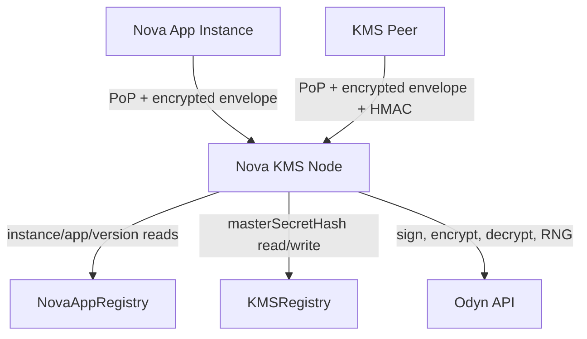

# Nova KMS Architecture

This document describes the Rust node that lives in `src/` today. It is written against the current router, state model, sync flow, and contract clients.

## 1. System Overview

Nova KMS is an Axum service with three stateful responsibilities:

1. authorize Nova app instances and KMS peers from on-chain data
2. converge on one cluster master secret
3. serve key-derivation and encrypted KV operations


```mermaid
graph TD
    App[Nova App Instance]
    Peer[KMS Peer]
    Node[Nova KMS Node]
    Registry[NovaAppRegistry]
    KMSRegistry[KMSRegistry]
    Odyn[Odyn API]

    App -->|PoP + encrypted envelope| Node
    Peer -->|PoP + encrypted envelope + HMAC| Node
    Node -->|instance/app/version reads| Registry
    Node -->|masterSecretHash read/write| KMSRegistry
    Node -->|sign, encrypt, decrypt, RNG| Odyn
```

## 2. Core Components

### 2.1 HTTP Layer

`src/server.rs` exposes the complete route surface:

| Route | Method | Handler role |
| --- | --- | --- |
| `/` | `GET` | API overview JSON |
| `/health` | `GET` | liveness |
| `/status` | `GET` | readiness, identity, store stats |
| `/nonce` | `GET` | single-use nonce issuance |
| `/nodes` | `GET` | peer-cache dump |
| `/kms/derive` | `POST` | app-scoped HKDF |
| `/kms/data` | `GET` | list keys or fetch by query |
| `/kms/data/*key` | `GET` | fetch by path |
| `/kms/data` | `PUT` | write one record |
| `/kms/data` | `DELETE` | create tombstone |
| `/sync` | `POST` | delta, snapshot, or master-secret exchange |

No OpenAPI, Swagger UI, or ReDoc routes are registered by the current router.

### 2.2 Shared State

`src/state.rs` builds `AppState`:

- `Config`
- `DataStore`
- `OdynClient`
- `RegistryClient`
- `CachedNovaRegistry`
- `NonceStore`
- nonce token bucket
- `PeerCache`
- `MasterSecretManager`
- service-availability flags

### 2.3 Background Tasks

`src/main.rs` starts two Tokio loops:

- `node_tick`
  - runs once immediately
  - then repeats every `KMS_NODE_TICK_SECONDS`
- `sync_tick`
  - sleeps first
  - then repeats every `DATA_SYNC_INTERVAL_SECONDS`

## 3. Trust Roots

### 3.1 NovaAppRegistry

`NovaAppRegistry` is the authoritative source for:

- app status
- version status
- instance status
- `zkVerified`
- `teeWalletAddress`
- `teePubkey`
- `instanceUrl`
- current KMS membership via `getActiveInstances(KMS_APP_ID)`

The runtime uses it in two ways:

- `CachedNovaRegistry` for app-route authorization
- `PeerCache` for peer authorization and peer metadata

### 3.2 KMSRegistry

`KMSRegistry` is not used for runtime peer discovery. Its live role is:

- hold `kmsAppId`
- keep an operator set via NovaAppRegistry callbacks
- hold `masterSecretHash`
- gate `setMasterSecretHash` so only an ACTIVE KMS instance on an ENROLLED version can set it while the hash is zero

## 4. Identity Model

Every node instance has two independent identities:

| Identity | Curve / format | Source | Used for |
| --- | --- | --- | --- |
| wallet | secp256k1 address | Odyn signing identity / `teeWalletAddress` | PoP and response signatures |
| `teePubkey` | P-384 DER/SPKI | Odyn encryption key / `teePubkey` | request and response encryption |

The node treats both as independent facts and validates both:

- wallet from recovered PoP signature
- `teePubkey` from the encrypted envelope against on-chain state

## 5. Authentication And Authorization

### 5.1 App Requests

`authenticate_app()` in `src/auth.rs` accepts:

- PoP headers:
  - `x-app-signature`
  - `x-app-nonce`
  - `x-app-timestamp`
  - optional `x-app-wallet`
- or, only when `IN_ENCLAVE=false`, the dev shortcut:
  - `x-tee-wallet`

Authorization then reads:

1. instance by recovered wallet
2. app by `app_id`
3. version by `(app_id, version_id)`

The request is accepted only when:

- instance is ACTIVE
- instance is `zkVerified`
- app is ACTIVE
- version is not REVOKED

### 5.2 Peer Requests

`authenticate_kms_peer()` verifies PoP, then `PeerCache.verify_kms_peer()` checks:

- peer is present in `PeerCache`
- peer instance is ACTIVE
- peer is `zkVerified`
- peer `app_id == KMS_APP_ID`
- peer has a non-empty `teePubkey`

`/sync` is cache-first. It does not query `NovaAppRegistry` on the hot path.

## 6. Encrypted Request Model

Sensitive request and response bodies use the same envelope:

```json
{
  "sender_tee_pubkey": "<hex DER/SPKI>",
  "nonce": "<hex>",
  "encrypted_data": "<hex>"
}
```

Processing rules:

1. authenticate the caller
2. resolve the caller's expected `teePubkey`
3. require `sender_tee_pubkey` to match that on-chain value
4. decrypt with Odyn
5. process the inner JSON
6. encrypt the response to the caller's `teePubkey`

Plaintext business payloads are rejected.

## 7. Readiness And Master Secret State

`node_tick()` in `src/sync.rs` controls readiness.

The node is unavailable when any of these fail:

- peer refresh fails and there is no cached membership
- this node is not present in KMS membership
- local `teePubkey` differs from the registry entry for this wallet
- `masterSecretHash` cannot be read
- local master secret cannot be reconciled with the chain

The node becomes available only after:

- membership is valid
- local `teePubkey` matches the registry
- local master secret matches `masterSecretHash`
- a sync HMAC key is derived from that master secret

`/health` does not reflect any of the above. `/status.node.service_available` does.

## 8. Data Model

`DataStore` is a map of `app_id -> Namespace`.

Each `DataRecord` contains:

- `key`
- `encrypted_value`
- `version` as a vector clock
- `updated_at_ms`
- `tombstone`
- `ttl_ms`

Storage characteristics:

- namespace-scoped size limit: `MAX_APP_STORAGE_BYTES`
- per-value input limit on `PUT`: `MAX_KV_VALUE_SIZE_BYTES`
- values are stored encrypted with a key derived from the master secret and `app_id`
- records are kept in-memory only
- expired entries and old tombstones are cleaned during namespace access

## 9. Sync Model

### 9.1 Outbound

`sync_tick()` calls `push_deltas()` when:

- `sync_key` exists
- `service_available` is true

`push_deltas()`:

1. reads records updated since `last_push_ms - 1`
2. builds a per-`app_id` delta payload
3. fetches a nonce from each peer
4. signs `NovaKMS:Auth:<nonce>:<peer_wallet>:<ts>`
5. encrypts the request body to the peer `teePubkey`
6. HMAC-signs the on-the-wire envelope JSON
7. posts to `/sync`
8. verifies `X-KMS-Peer-Signature`

### 9.2 Inbound

`/sync` accepts three request types:

- `delta`
- `snapshot_request`
- `master_secret_request`

For `delta`, each record is validated and merged.

For `snapshot_request`, the receiver returns the full store snapshot.

For `master_secret_request`, the receiver seals the master secret with ephemeral P-384 ECDH and AES-256-GCM.

### 9.3 Conflict Resolution

Namespace merge rules are:

- strictly newer vector clock wins
- older vector clock loses
- equal vector clock is ignored
- concurrent updates use:
  - larger `updated_at_ms`
  - if timestamps tie, lexicographically larger ciphertext
- concurrent replacement merges vector clocks before storing

Definitions:

- `equal vector clock` means both records have the same counter for every node dimension
  - example: `{A: 2, B: 1}` vs `{A: 2, B: 1}`
- `concurrent` means neither record fully includes the other
  - example: `{A: 1, B: 2}` vs `{A: 2, B: 1}`
  - one side is newer on some dimensions, and the other side is newer on other dimensions
  - only this case falls back to `updated_at_ms` for tie-breaking

## 10. Observability

### 10.1 `/status`

`/status` returns three top-level objects:

- `node`
  - wallet
  - `tee_pubkey`
  - `node_url`
  - `is_operator`
  - `service_available`
  - `master_secret.state`
  - `master_secret.synced_from`
  - `master_secret_initialized`
- `cluster`
  - `kms_app_id`
  - `registry_address`
  - `total_instances`
- `data_store`
  - `namespaces`
  - `total_keys`
  - `total_bytes`

### 10.2 `/nodes`

`/nodes` reflects `PeerCache`, not a fresh on-chain read. In enclave mode each entry also includes cached `/status` probe metadata.
