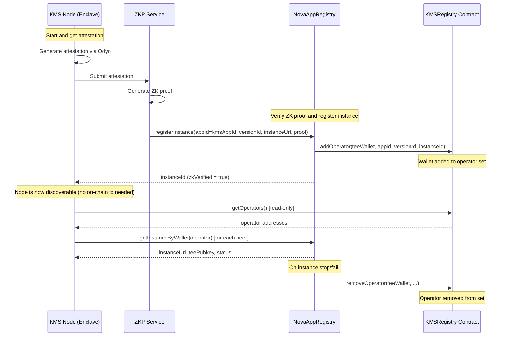
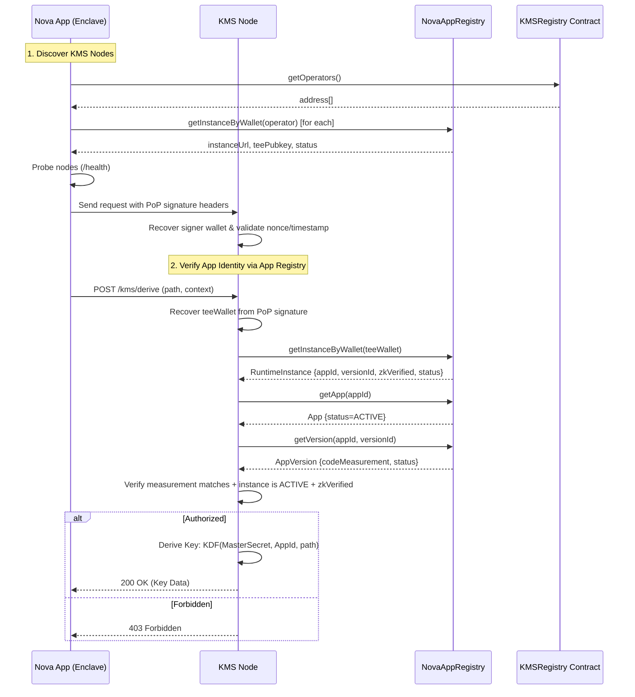
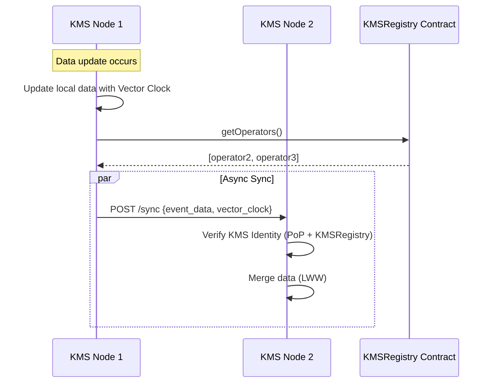

# Distributed Blockchain KMS Service - Architecture Design

## Overview

Design a distributed Key Management Service (KMS) running in AWS Nitro Enclave, deployed as a Nova Platform application and serving other Nova Platform applications. The KMS provides a **Key Derivation Service** and an **in-memory KV store**, with access controlled by **on-chain app registration** in the Nova App Registry. Applications are identified by their **App ID** (a `uint256` assigned by `NovaAppRegistry`), while code upgrades are managed as new **Versions** on-chain. KMS operator membership is tracked on-chain by a dedicated **KMSRegistry** contract that receives operator callbacks from NovaAppRegistry. **KMS nodes do NOT submit any on-chain transactions** — clients and KMS nodes discover peers by querying `KMSRegistry.getOperators()` then looking up instance details from `NovaAppRegistry.getInstanceByWallet()`. Node health is determined by clients via live probes. Request authentication uses **lightweight Proof-of-Possession (PoP) signatures** bound to on-chain identities.


---

## 1. System Components

### 1.1 KMS Enclave Application

A Python/Flask application running inside AWS Nitro Enclave, packaged and deployed on the Nova Platform. It serves other Nova apps and enforces access control using on-chain app registration data.

**Core Features:**

| Feature | Description |
|---------|-------------|
| In-memory KV Store | `dict[AppId, dict]` - partitioned by application identity, **non-persistent** |
| **Key Derivation (KDF)** | Derive application-specific keys from cluster-wide master secret |
| **CA / Cert Signing** | Issue TLS certificates for apps rooted in KMS trust anchor |
| Request Verification | Verify App identity via NovaAppRegistry (App -> Version -> Instance) |
| Authentication | PoP signatures bound to on-chain identities |
| Health Probing | Client-side probes determine liveness |
| Status Monitoring | `/status` endpoint showing KMS cluster health |

**Odyn API Usage:**

```python
# Get KMS node identity on startup
eth_address = odyn.eth_address()      # KMS Ethereum address
random_bytes = odyn.get_random_bytes() # Hardware RNG
sig = odyn.sign_message(msg)          # EIP-191 signing for PoP
```

### 1.2 On-chain Contracts

#### 1.2.1 NovaAppRegistry (App Registry)

The KMS relies on **NovaAppRegistry** as the source of truth for app identity, code measurement, and runtime instances. The registry is organized as **App -> Version -> Instance**:

- **App**: `appId`, owner, optional `dappContract`, status
- **Version**: `versionId`, `codeMeasurement`, status
- **Instance**: `teeWalletAddress`, `teePubkey`, `instanceUrl`, `zkVerified`, status

Minimal interface used by KMS (aligned with `NovaAppRegistry.sol`):

```solidity
// SPDX-License-Identifier: Apache-2.0
pragma solidity ^0.8.33;

interface INovaAppRegistry {
    enum AppStatus { ACTIVE, INACTIVE, REVOKED }
    enum VersionStatus { ENROLLED, DEPRECATED, REVOKED }
    enum InstanceStatus { ACTIVE, STOPPED, FAILED }

    struct App {
        uint256 appId;
        address owner;
        bytes32 teeArch;
        address dappContract;
        string metadataUri;
        uint256 latestVersionId;
        uint256 createdAt;
        AppStatus status;
    }

    struct AppVersion {
        uint256 versionId;
        string versionName;
        bytes32 codeMeasurement;
        string imageUri;
        string auditUrl;
        string auditHash;
        string githubRunId;
        VersionStatus status;
        uint256 enrolledAt;
        address enrolledBy;
    }

    struct RuntimeInstance {
        uint256 instanceId;
        uint256 appId;
        uint256 versionId;
        address operator;
        string instanceUrl;
        bytes teePubkey;
        address teeWalletAddress;
        bool zkVerified;
        InstanceStatus status;
        uint256 registeredAt;
    }

    function getApp(uint256 appId) external view returns (App memory);
    function getVersion(uint256 appId, uint256 versionId) external view returns (AppVersion memory);
    function getInstance(uint256 instanceId) external view returns (RuntimeInstance memory);
    function getInstanceByWallet(address teeWalletAddress) external view returns (RuntimeInstance memory);
    function getInstancesForVersion(uint256 appId, uint256 versionId) external view returns (uint256[] memory);
}
```

Operational note: NovaAppRegistry is **UUPS upgradeable**; always interact with the **proxy address**.

> Note: `appId` is a **uint256 assigned by NovaAppRegistry**, not a contract address. If an app uses an on-chain contract, it is referenced via the optional `dappContract` field.

#### 1.2.2 KMSRegistry (Operator List)

A standalone smart contract implementing **`INovaAppInterface`** that maintains a pure operator set managed by NovaAppRegistry callbacks. **No KMSNode struct, no node self-registration, no on-chain transactions from KMS nodes.**

**INovaAppInterface Integration:**

```solidity
interface INovaAppInterface {
    function addOperator(address teeWalletAddress, uint256 appId, uint256 versionId, uint256 instanceId) external;
    function removeOperator(address teeWalletAddress, uint256 appId, uint256 versionId, uint256 instanceId) external;
    function setNovaAppRegistry(address registry) external;
    function novaAppRegistry() external view returns (address);
}
```

**Operator Lifecycle:**

1. **`addOperator`** — Called by NovaAppRegistry when a TEE instance registers for the KMS app. Adds the wallet to the operator set. Validates `appId == kmsAppId`. Idempotent.
2. **`removeOperator`** — Called by NovaAppRegistry when instance stops/fails. Removes from operator set using O(1) swap-and-pop. Idempotent.

**Discovery Pattern (off-chain):**

Clients and KMS nodes discover peers by:
1. Querying `KMSRegistry.getOperators()` → list of operator addresses
2. For each operator, querying `NovaAppRegistry.getInstanceByWallet(operator)` → `instanceUrl`, `teePubkey`, `teeWalletAddress`, `zkVerified`, `status`

```solidity
// SPDX-License-Identifier: Apache-2.0
pragma solidity ^0.8.33;

import {INovaAppInterface} from "./interfaces/INovaAppInterface.sol";

contract KMSRegistry is INovaAppInterface {
    address private _novaAppRegistryAddr;
    uint256 public kmsAppId;
    address public admin;

    // Operator set (managed by addOperator/removeOperator callbacks)
    mapping(address => bool) private _isOperator;
    address[] private _operatorList;
    mapping(address => uint256) private _operatorIndex;

    // INovaAppInterface
    function setNovaAppRegistry(address registry) external onlyAdmin;
    function novaAppRegistry() external view returns (address);
    function addOperator(address, uint256, uint256, uint256) external onlyNovaAppRegistry;
    function removeOperator(address, uint256, uint256, uint256) external onlyNovaAppRegistry;

    // Views
    function isOperator(address) external view returns (bool);
    function operatorCount() external view returns (uint256);
    function operatorAt(uint256 index) external view returns (address);
    function getOperators() external view returns (address[] memory);
}
```

Interaction summary:
- **NovaAppRegistry → KMSRegistry**: `addOperator`/`removeOperator` callbacks manage the operator set. The `dappContract` field of the KMS app on NovaAppRegistry must point to the KMSRegistry address.
- **KMSRegistry does NOT read from NovaAppRegistry** — it only stores addresses.
- **Clients/KMS nodes** query `getOperators()` then look up instance details from NovaAppRegistry.
- KMS nodes do NOT submit any on-chain transactions. All on-chain state is managed by NovaAppRegistry callbacks.
- A KMS node is considered healthy if it is an operator on-chain and passes client-side liveness probes.

---

## 2. Core Flows

### 2.1 KMS Node Registration Flow



> [!IMPORTANT]
> **Security Mechanism**: The `addOperator` callback validates `appId == kmsAppId`, ensuring only verified KMS instances are added to the operator set. KMS nodes **never submit on-chain transactions** — all state management flows through NovaAppRegistry callbacks. When NovaAppRegistry calls `removeOperator`, the operator is removed from the set.

### 2.2 App Request Flow (PoP + App Registry)



### 2.3 App Authorization Logic (Instance + App Registry)

```python
async def verify_app_request(request: KMSRequest, client_attestation: Attestation) -> tuple[bool, str | None]:
    """
    Verify that request comes from a valid and authorized Nova application.
    
    Steps:
    1. Recover TEE wallet from PoP signature (EIP-191) bound to nonce + timestamp.
    2. Query NovaAppRegistry to map wallet -> instance (appId, versionId).
    3. Verify instance is ACTIVE and zkVerified.
    4. Fetch App + Version to ensure:
       - App status is ACTIVE.
       - Version status is ENROLLED/DEPRECATED.
       - Code measurement matches the enrolled version.
    """
    measurement = client_attestation.get_measurement()
    tee_wallet = client_attestation.get_extension("TEE_WALLET")
    
    instance = await nova_app_registry.get_instance_by_wallet(tee_wallet)
    if instance.instance_id == 0:
        return False, "Instance not found"
    if not instance.zk_verified or instance.status != "ACTIVE":
        return False, "Instance not verified or inactive"
    
    app = await nova_app_registry.get_app(instance.app_id)
    version = await nova_app_registry.get_version(instance.app_id, instance.version_id)
    
    if app.status != "ACTIVE":
        return False, "App not active"
    if version.status not in {"ENROLLED", "DEPRECATED"}:
        return False, "Version not allowed"
    if version.code_measurement != measurement:
        return False, "Measurement mismatch"
    
    # 5. Success - Proceed with KDF or KV operation, using app_id as namespace
    return True, None
```

### 2.4 Data Synchronization Flow (PoP Secured)

KMS nodes synchronize data using attested requests verified in-app.



---

## 3. API Design

### 3.1 KMS Node API

| Endpoint | Method | Description | Auth |
|----------|--------|-------------|------|
| `/health` | GET | Health check | None |
| `/status` | GET | KMS node + cluster view | None |
| `/nonce` | GET | Issue one-time PoP nonce | None |
| `/kms/derive` | POST | **Derive application key** (KDF) | App PoP + NovaAppRegistry verification |
| `/kms/sign_cert`| POST | **Sign certificate** (CA) | App PoP + NovaAppRegistry verification |
| `/kms/data` | GET/PUT/DELETE | KV data operations | App PoP + NovaAppRegistry verification |
| `/sync` | POST | Receive sync event from other KMS nodes | KMS peer PoP + KMSRegistry operator verification |
| `/nodes` | GET | Get list of KMS operators | None |

### 3.2 Status Endpoint Response

The `/status` endpoint returns a merged view of local health and on-chain cluster state. Cluster health is derived from client-side probes plus on-chain `isActive` flags.

```json
{
    "node": {
        "tee_wallet": "0x1234...",
        "node_url": "https://kms-7.nova",
        "is_operator": true,
        "master_secret_initialized": true
    },
    "cluster": {
        "kms_app_id": 9001,
        "registry_address": "0xabc...",
        "total_operators": 12
    }
}
```

### 3.3 Request Format (PoP Secured)
Payload format is simple JSON.

> Note: The KMS **does not trust client-provided App IDs**. It derives `appId`
> from the attested TEE wallet via NovaAppRegistry. If a header is provided,
> it must match.
>
> **No trusted middleboxes**: the enclave application does not trust any proxy
> or TLS terminator. In production, the caller must provide PoP signature
> headers that the enclave verifies directly against on-chain registered
> identities.

**POST /kms/derive**
```json
{
  "path": "app_disk_encryption",
  "context": "v1",
  "nonce": "random-uuid"
}
```

**POST /kms/sign_cert**
```json
{
  "csr": "base64_encoded_csr",
  "usage": "https_server"
}
```

### 3.4 Key Derivation (KDF) Implementation

KMS uses a Cluster Master Secret (held in TEE memory) to derive keys using HKDF.

```python
def derive_app_key(master_secret: bytes, app_id: str, path: str) -> bytes:
    """Derive a stable, unique key for an app."""
    return HKDF(
        algorithm=hashes.SHA256(),
        length=32,
        salt=app_id.encode(),
        info=path.encode()
    ).derive(master_secret)
```

---

## 4. Data Synchronization Protocol

### 4.1 Membership and Sync Strategy

- **Membership source**: nodes query `KMSRegistry.getOperators()` → then `NovaAppRegistry.getInstanceByWallet()` for each operator, and filter for healthy peers using probes.
- **Anti-entropy**: periodic push/pull of recent updates (delta sync) to peers.
- **Catch-up**: if a node is far behind (vector clock gap exceeds threshold), request a **snapshot** from a healthy peer.
- **Security**: all sync messages are authenticated with PoP and validate the sender is a healthy, registered KMS node.
- **Backpressure**: rate-limit sync and snapshot requests to avoid amplification during spikes.

### 4.2 Vector Clock Based Sync

Uses Vector Clock for eventual consistency to avoid conflicts.

```python
class VectorClock:
    """Vector clock for distributed consistency."""
    
    def __init__(self, node_id: str):
        self.node_id = node_id
        self.clock: dict[str, int] = {}
    
    def increment(self):
        self.clock[self.node_id] = self.clock.get(self.node_id, 0) + 1
    
    def merge(self, other: "VectorClock"):
        for node_id, count in other.clock.items():
            self.clock[node_id] = max(self.clock.get(node_id, 0), count)
    
    def is_concurrent(self, other: "VectorClock") -> bool:
        """Check if two clocks are concurrent (neither happened-before)."""
        self_greater = any(
            self.clock.get(k, 0) > other.clock.get(k, 0) 
            for k in self.clock
        )
        other_greater = any(
            other.clock.get(k, 0) > self.clock.get(k, 0) 
            for k in other.clock
        )
        return self_greater and other_greater
```

### 4.3 Conflict Resolution

For concurrent writes, uses **Last-Writer-Wins (LWW)** strategy based on timestamp.

### 4.4 Internal Data Storage (Non-Persistent)

The KMS **does not persist data to disk**. All state lives in enclave memory and is rebuilt from peers after restart.

**Storage Model (per App ID namespace):**

```python
class DataRecord:
    key: str
    value: bytes              # optionally encrypted with per-app data key
    version: VectorClock
    updated_at_ms: int
    tombstone: bool
    ttl_ms: int | None
```

**Notes:**
- **Non-persistent**: no filesystem writes; no local database.
- **Rehydration**: on startup, node performs sync and/or snapshot to rebuild state.
- **Limits**: per-app size quota + LRU eviction; TTL expiration for stale records.
- **Security**: current implementation keeps values in plaintext within enclave
  memory. A helper `derive_data_key(master_secret, app_id, "data_key")` exists
  for future in-memory encryption, but is not yet wired into the data path.

---

## 5. Security Considerations

### 5.1 Threat Model

| Threat | Mitigation |
|--------|------------|
| Unauthorized data access | PoP + NovaAppRegistry instance verification |
| App Code Upgrade Leak | App/Version hierarchy allows owners to rotate approved measurements |
| Man-in-the-middle | TLS + in-app attestation verification (no trusted proxies) |
| Replay attack | Attestation timestamp window (configurable) |
| Node impersonation during sync | PoP + KMSRegistry operator verification |

### 5.2 Access Control Matrix (Instance Based)

| Actor | Derive Key | GET/PUT Data | SIGN CERT | SYNC |
|-------|-----|-----|--------|------|
| Authorized App Instance (zkVerified + ACTIVE) | ✅ | ✅ | ✅ | ❌ |
| Unregistered / Inactive Instance | ❌ | ❌ | ❌ | ❌ |
| Registered KMS node | ❌ | ❌ | ❌ | ✅ |

### 5.3 Sync Request Verification

```python
async def verify_sync_request(request: SyncRequest, client_attestation: Attestation) -> bool:
    """Verify that sync request comes from a valid KMS operator."""
    # 1. Recover KMS Node wallet from PoP signature
    tee_wallet = client_attestation.get_extension("TEE_WALLET")
    
    # 2. Check if it's a registered operator
    return kms_registry.is_operator(tee_wallet)
```

---

## 6. Project Structure

```
nova-kms/
├── contracts/
│   ├── src/
│   │   ├── KMSRegistry.sol    # KMS node registry contract
│   │   └── interfaces/
│   │       └── INovaAppInterface.sol
│   ├── script/
│   │   └── DeployKMSRegistry.s.sol
│   └── test/
│       └── KMSRegistry.t.sol
├── enclave/
│   ├── app.py                 # Main application
│   ├── auth.py                # Authorization logic
│   ├── nova_registry.py       # NovaAppRegistry client
│   └── ...
├── scripts/                   # Development scripts
├── Dockerfile                 # Production Docker image
├── Makefile                   # Project automation
└── README.md
```

---

## 7. Deployment

### 7.1 Prerequisites
1. Nova Platform account
2. NovaAppRegistry proxy address (deployed by Nova Platform)
3. KMSRegistry contract deployed (configured with NovaAppRegistry + kmsAppId)
4. KMS app created in Nova Platform (appId assigned)

### 7.2 Deployment Steps

1. **Deploy KMSRegistry contract**
   ```bash
   cd contracts
   forge script script/DeployKMSRegistry.s.sol --broadcast
   ```
   - **Note**: This script will output both an **Implementation Address** and a **Proxy Address**. 
   - **Important**: Save the **Proxy Address**. This is the address you will provide to the Nova Platform and use for all configuration.

2. **Create KMS application**
   - Create new app in Nova Platform
   - Record `kmsAppId` assigned by NovaAppRegistry
   - Enable ZK verification

3. **Trigger build and deploy**
   - Trigger GitHub Actions build
   - Deploy to Nitro Enclave

4. **Verify operator registration**
   - ZKP service automatically generates proof
   - NovaAppRegistry verifies `registerInstance(...)` (zkVerified = true)
   - NovaAppRegistry calls `KMSRegistry.addOperator()` → node is discoverable
   - KMS node does NOT need any on-chain transactions

---

## Next Steps

1. Implement KMSRegistry smart contract
2. Implement KMS enclave application core logic (attestation + KDF)
3. Implement data synchronization protocol with attested requests
4. Deploy to test environment for verification
