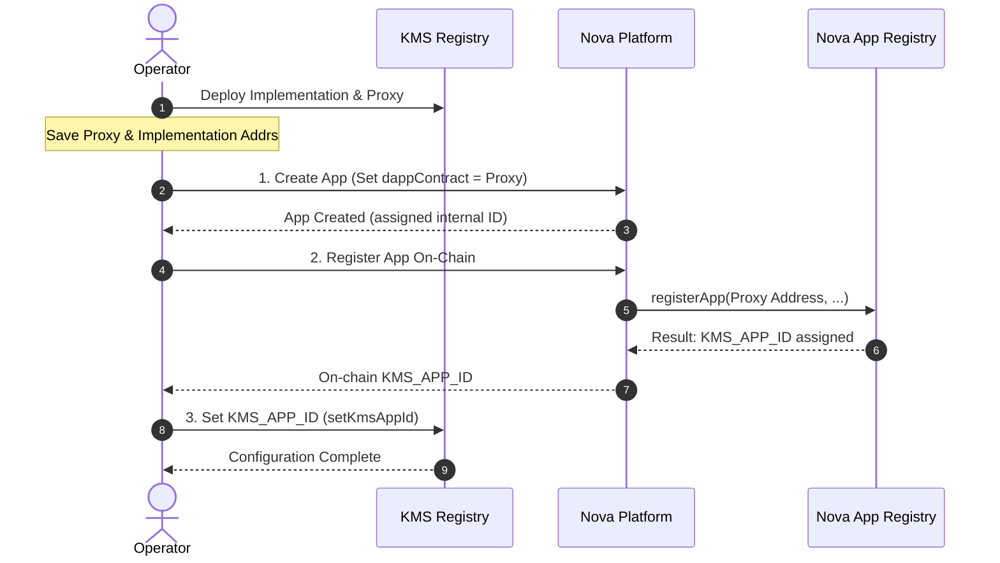
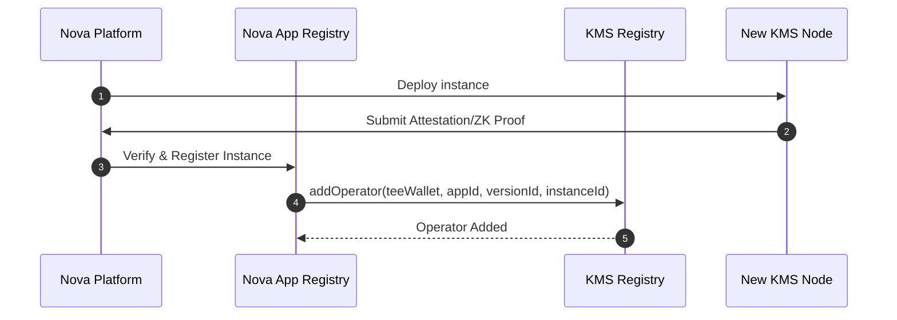
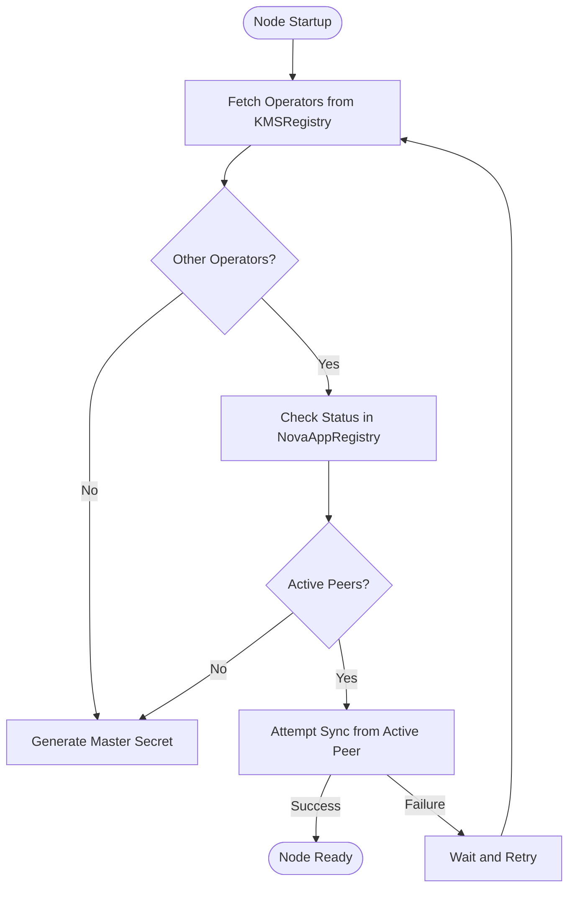
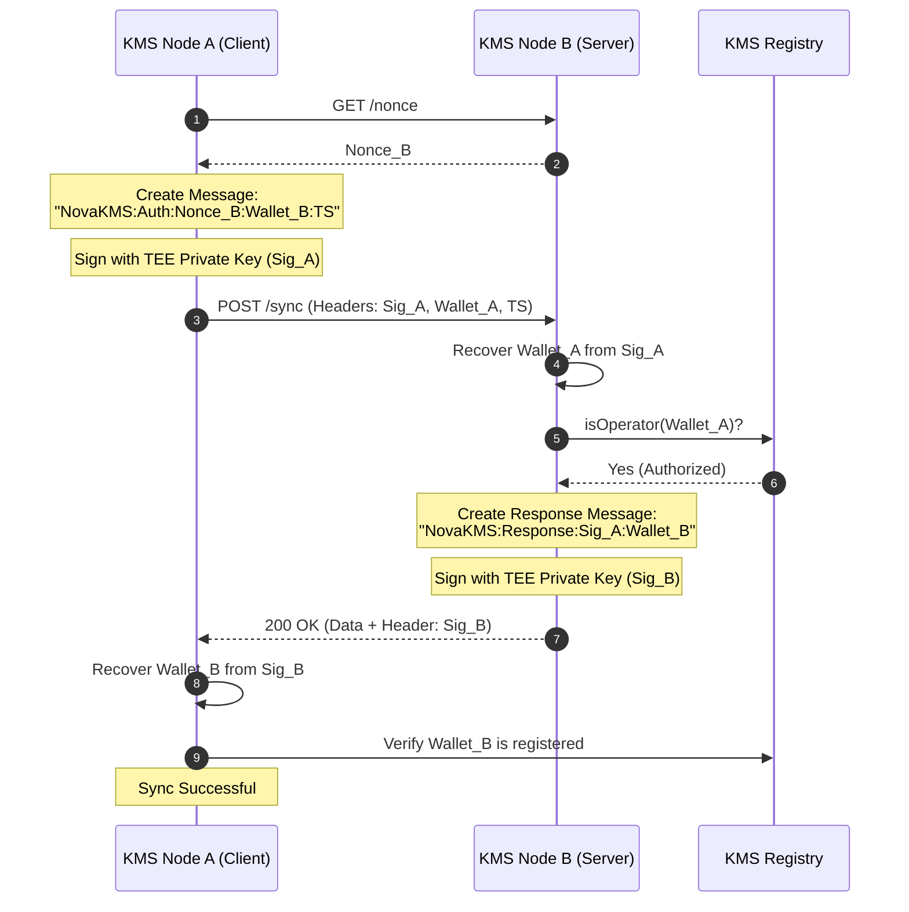
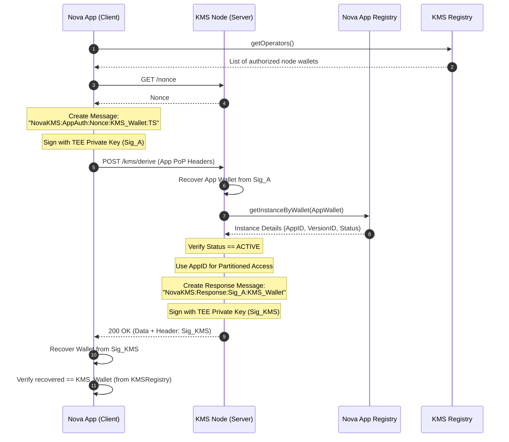

# KMS Core Workflows & Security Architecture

This document consolidates the complete lifecycle and security architecture for Nova KMS, covering deployment, node enrollment, anti-split-brain initialization, and lightweight mutual authentication.

---

## 1. KMS Registry Deployment & Platform Registration

The `KMSRegistry` contract is the trust anchor for the KMS cluster. It must be deployed and correctly linked to the Nova Platform before nodes can join.

### Workflow
1.  **Contract Deployment**:
    - Deploy `KMSRegistry` implementation and proxy contracts.
    - **Note**: This process yields both a **Proxy Address** (stable entry point) and an **Implementation Address** (logic backend).
    - Initialize the proxy with the platform's `NovaAppRegistry` address.
2.  **Platform App Creation**:
    - Create a new application on the **Nova Platform** (e.g., via `POST /apps`).
    - **Crucial**: You must provide the `KMSRegistry` proxy address as the `dappContract` during this step.
    - This creates the off-chain record for the service.
3.  **On-Chain Registration**:
    - In the Nova Platform UI/API, perform the **Register App On-Chain** step.
    - The platform submits a transaction to `NovaAppRegistry` using the `dappContract` address provided in Step 2.
    - Once confirmed, the platform provides the on-chain **Application ID** (`KMS_APP_ID`).
4.  **KMS ID Configuration**:
    - Set the assigned `KMS_APP_ID` on the `KMSRegistry` contract (e.g., via `make set-app-id` / `setKmsAppId`). 
    - This allows the registry to verify that callbacks (like `addOperator`) are coming from the legitimate platform registry for the correct app.

### Mermaid Diagram


---

## 2. KMS Node Join & Enrollment

Once the registry is live, new nodes can be deployed and automatically enrolled into the cluster.

### Workflow
1. A KMS node is deployed on Nova Platform as an instance of the KMS app.
2. Nova Platform performs the standard enrollment:
    - Verifies the node's ZK proof (hardware attestation).
    - Checks the code measurement against the enrolled version.
3. If valid, Nova Platform registers the instance in `NovaAppRegistry`.
4. **Callback**: `NovaAppRegistry` automatically calls `addOperator` on the `KMSRegistry` address stored as `dappContract`.
5. `KMSRegistry` records the new node's TEE wallet as an authorized operator.

### Mermaid Diagram


---

## 3. Anti-Split-Brain Initialization

The primary goal of the initialization process is to ensure that all KMS nodes within a cluster share the same **Master Secret**. 

### The Problem
When a node starts, it must decide whether to:
1.  **Sync**: Fetch the existing secret from an active peer.
2.  **Generate**: Create a new secret (only as the cluster "seed").

A "Split-Brain" scenario occurs if two or more nodes generate different master secrets (e.g., due to simultaneous startup or network partition), leading to localized data silos and total system inconsistency.

### Strict Initialization Logic
To prevent this, KMS nodes implement a strict retry loop that always restarts upon any failure or uncertainty:
1.  **Operator Discovery**: Fetch all registered KMS operators from the `KMSRegistry` contract.
2.  **Self-Check**: If the registry contains **only** the current node, it is the absolute seed. **Generate** secret.
3.  **Peer Status Check**: Query `NovaAppRegistry` for the runtime status of all other operators.
4.  **Seed Node Condition**: If **all** other operators are `INACTIVE` or `FAILED`, the current node acts as the seed. **Generate** secret.
5.  **Sync Attempt**: If any other operator is `ACTIVE`, the node **must** sync from one of them.
6.  **Fail-Fast & Retry**: If active peers exist but are unreachable, or if authentication fails, the node **must not** fallback to generation. Instead, it waits and restarts the entire loop from step 1.

### Diagram: Initialization Loop


---

## 4. Inter-Node Mutual Authentication (Lightweight PoP)

KMS nodes perform **Mutual Authentication** at the application layer using a **Lightweight Proof of Possession (PoP)** handshake.

### Why PoP?
Since every KMS node's identity is already verified via ZKP and recorded on-chain, we can use signatures for performance instead of full 4KB attestation documents.

### Handshake Flow
1.  **Challenge**: Node A (Client) calls `GET /nonce` on Node B (Server) to get $Nonce_B$.
2.  **Signature A ($Sig\_A$)**: Node A signs a message binding the challenge, the recipient, and a timestamp:
    `NovaKMS:Auth:<Nonce_B>:<Wallet_B>:<Timestamp_A>`
    This signature is sent in the `X-KMS-Signature` header.
3.  **Request**: Node A sends `POST /sync` with PoP headers.
4.  **Verification B**: 
    - Node B recovers $Wallet_A$ from $Sig\_A$.
    - Node B queries **KMSRegistry** to confirm $Wallet_A$ is an authorized operator.
5.  **Mutual Proof**: Node B returns its own signature on the Client's signature ($Sig\_A$) to prove receipt and processing:
    `NovaKMS:Response:<Sig_A>:<Wallet_B>`
    returned in header `X-KMS-Peer-Signature`.
6.  **Verification A**: Node A verifies Node B's signature against the operator list from **KMSRegistry**.

### HTTP Headers (Implementation)
- `GET /nonce` returns JSON: `{ "nonce": "<base64>" }`.
- Node A → Node B `POST /sync`:
    - `X-KMS-Signature`: $Sig_A$
    - `X-KMS-Nonce`: the base64 nonce string returned by `/nonce`
    - `X-KMS-Timestamp`: unix epoch seconds (integer)
    - `X-KMS-Wallet`: optional hint (server recovers wallet from signature)
    - `X-Sync-Signature`: hex HMAC-SHA256 of the canonical JSON body (required once the cluster sync key is initialized)
- Node B → Node A response:
    - `X-KMS-Peer-Signature`: $Sig_B$ where $Sig_B$ signs `NovaKMS:Response:<Sig_A>:<Wallet_B>`

> Notes:
> - Header names are case-insensitive; examples use `X-*` for readability.
> - `X-Sync-Signature` defends against cross-operator amplification and accidental/buggy peers once nodes share a master secret.

### Diagram: Inter-Node Mutual PoP


---

## 5. Nova App Access to KMS (Mutual PoP)

KMS supports **Lightweight PoP** for high-performance app API calls.

### Mutual PoP Handshake Flow
1.  **Discovery**: App queries **KMSRegistry** to get the list of authorized node wallets.
2.  **Challenge**: App calls `GET /nonce` on a selected KMS node.
3.  **Signature A ($Sig\_A$)**: App signs a message binding the challenge and the node:
    `NovaKMS:AppAuth:<Nonce>:<KMS_Wallet>:<Timestamp>`
    This is sent in the `X-App-Signature` header.
4.  **Authenticated Request**: App calls KMS API (e.g., `POST /kms/derive`) with PoP headers.
5.  **Verification & Permission Management**: 
    - KMS recovers App wallet signer from $Sig\_A$.
    - KMS queries **NovaAppRegistry** using the `app_wallet` to find the corresponding **`app_id`**.
    - KMS verifies the app status is `ACTIVE`.
    - KMS uses the **`app_id`** to enforce permission boundaries (e.g., ensuring an app only accesses its own derived keys or KV namespace).
6.  **Mutual Proof**: KMS returns its signature on $Sig\_A$ to prove it processed the request:
    `NovaKMS:Response:<Sig_A>:<KMS_Wallet>`
    returned in response header `X-KMS-Response-Signature`.
7.  **Verification A**: App verifies KMS node's identity against the $KMS\_Wallet$ recorded in **KMSRegistry**.

### HTTP Headers (Implementation)
- App → KMS request headers:
    - `X-App-Signature`: $Sig_A$
    - `X-App-Nonce`: the base64 nonce string returned by `/nonce`
    - `X-App-Timestamp`: unix epoch seconds (integer)
    - `X-App-Wallet`: optional hint (server recovers wallet from signature)
- KMS → App response headers:
    - `X-KMS-Response-Signature`: $Sig_{KMS}$ where $Sig_{KMS}$ signs `NovaKMS:Response:<Sig_A>:<KMS_Wallet>`

### Diagram: App-to-KMS Mutual PoP


---

## 6. API Reference: Key Derivation (`/kms/derive`)

The `/kms/derive` endpoint allows an authorized app to derive deterministic keys for specific paths.

### Request Body (`POST /kms/derive`)
```json
{
  "path": "m/0/1",       // The derivation path string (e.g. BIP-32 style or custom)
  "context": "signing",  // Optional context string for domain separation
  "length": 32           // Optional length of the derived key in bytes (default 32)
}
```

### Response Body
```json
{
  "app_id": 123,         // The verified Application ID
  "path": "m/0/1",       // The path used for derivation
  "key": "base64...",    // The derived key (Base64 encoded)
  "length": 32           // The length of the derived key
}
```

---

## 7. Security Properties

| Property | Mechanism |
| :--- | :--- |
| **Authenticity** | Signatures are recovered into Wallet addresses which are strictly matched against on-chain Registry records (`KMSRegistry` for nodes, `NovaAppRegistry` for apps). |
| **Freshness** | One-time nonces and tight timestamps prevent replay attacks. |
| **Identity Binding** | Signatures include the recipient's wallet address, preventing "Reflection" or "Re-routing" attacks (a signature for Node B cannot be used to authenticate to Node C). |
| **Bidirectional Trust** | Mutual signatures ensure both client and server are verified against on-chain status before sensitive data is processed. |
| **Cluster Integrity** | The strict initialization loop ensures no node creates a parallel state if an active cluster already exists. |
