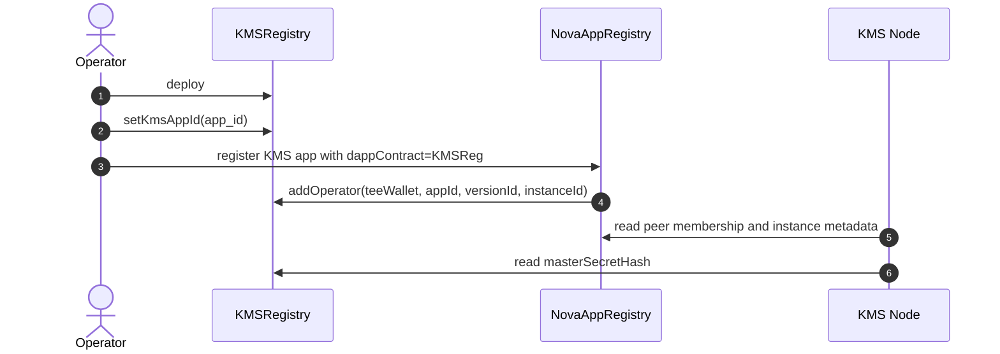
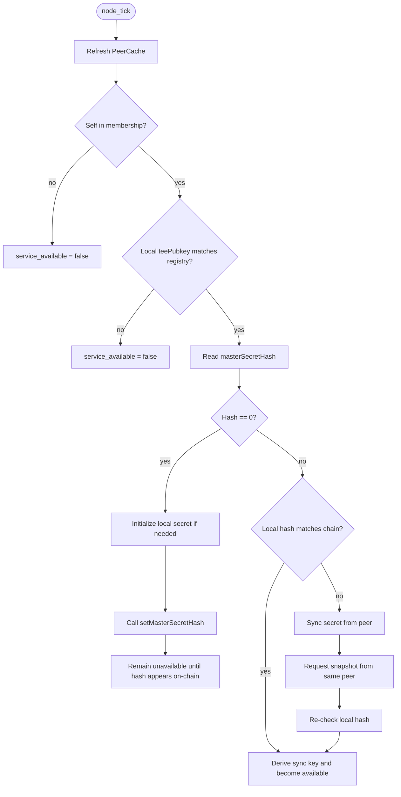

# Nova KMS Core Workflows

This document focuses on the live workflows implemented by the Rust node and the current `KMSRegistry` contract.

## 1. Contract And Platform Wiring

Before a node can ever become ready:

1. deploy `KMSRegistry`
2. point the Nova KMS app `dappContract` to that contract
3. call `setKmsAppId(app_id)` on `KMSRegistry`
4. deploy KMS instances so they appear in `NovaAppRegistry`

At runtime:

- peer membership comes from `NovaAppRegistry`
- cluster secret coordination comes from `KMSRegistry.masterSecretHash`


```mermaid
sequenceDiagram
    autonumber
    actor Operator
    participant KMSReg as KMSRegistry
    participant Nova as NovaAppRegistry
    participant Node as KMS Node

    Operator->>KMSReg: deploy
    Operator->>KMSReg: setKmsAppId(app_id)
    Operator->>Nova: register KMS app with dappContract=KMSReg
    Nova->>KMSReg: addOperator(teeWallet, appId, versionId, instanceId)
    Node->>Nova: read peer membership and instance metadata
    Node->>KMSReg: read masterSecretHash
```

## 2. Node Join And Membership

When a node instance is enrolled by Nova:

1. Nova verifies the instance and registers it in `NovaAppRegistry`
2. Nova calls `KMSRegistry.addOperator(...)`
3. `node_tick()` later refreshes `PeerCache`
4. the node confirms:
   - its wallet is present in current KMS membership
   - its local `teePubkey` matches the registry entry for that wallet

If either check fails, the node remains unavailable.

## 3. Startup And Master Secret Convergence

`node_tick()` drives master-secret convergence.

### 3.1 Decision Tree


```mermaid
flowchart TD
    Start([node_tick]) --> Refresh[Refresh PeerCache]
    Refresh --> SelfCheck{Self in membership?}
    SelfCheck -- no --> Unavailable1[service_available = false]
    SelfCheck -- yes --> PubkeyCheck{Local teePubkey matches registry?}
    PubkeyCheck -- no --> Unavailable2[service_available = false]
    PubkeyCheck -- yes --> ChainHash[Read masterSecretHash]
    ChainHash --> Zero{Hash == 0?}
    Zero -- yes --> Init[Initialize local secret if needed]
    Init --> SetHash[Call setMasterSecretHash]
    SetHash --> WaitChain[Remain unavailable until hash appears on-chain]
    Zero -- no --> Match{Local hash matches chain?}
    Match -- yes --> Ready[Derive sync key and become available]
    Match -- no --> SyncSecret[Sync secret from peer]
    SyncSecret --> Snapshot[Request snapshot from same peer]
    Snapshot --> Verify[Re-check local hash]
    Verify --> Ready
```

### 3.2 Bootstrap Rules

If `masterSecretHash == 0`:

- the node uses `MASTER_SECRET_HEX` if configured
- otherwise it generates 32 random bytes
- it computes `keccak256(master_secret)`
- it calls `setMasterSecretHash`

Current contract guard:

- only an ACTIVE KMS instance on an ENROLLED version can set the hash

### 3.3 Sync From Peer

If the chain already has a non-zero hash and local state is missing or mismatched:

1. fetch verified peers from `PeerCache`
2. create an ephemeral P-384 keypair
3. send `type=master_secret_request`
4. unseal the returned secret locally
5. install it as `init_state = "synced"`
6. immediately request `type=snapshot_request`
7. merge the snapshot into the local store

## 4. App Request Workflow

### 4.1 Authentication

The app request path is:

1. app fetches `/nonce`
2. app signs:
   - `NovaKMS:AppAuth:<nonce_b64>:<kms_wallet>:<timestamp>`
3. app sends PoP headers plus an encrypted envelope
4. KMS recovers the wallet
5. KMS reads instance, app, and version data from `CachedNovaRegistry`
6. KMS verifies `sender_tee_pubkey` against the app instance's on-chain `teePubkey`

### 4.2 Business Operations

Once authorized, the node can:

- derive an app key
- list keys in the caller namespace
- read one key
- write one key
- delete one key

All responses are encrypted back to the caller `teePubkey`.

If the caller used PoP, the node also signs:

- `NovaKMS:Response:<client_signature>:<kms_wallet>`

### 4.3 Readiness Gate

All `/kms/*` handlers first check `service_available`.

That means app traffic does not flow until cluster master-secret convergence is complete.

## 5. Peer Sync Workflow

### 5.1 Peer Authentication

For each `/sync` request:

1. peer fetches `/nonce`
2. peer signs:
   - `NovaKMS:Auth:<nonce_b64>:<recipient_wallet>:<timestamp>`
3. peer encrypts the request body to the recipient `teePubkey`
4. if a sync key exists and request type is not `master_secret_request`, peer adds `x-sync-signature`
5. receiver verifies:
   - nonce
   - timestamp
   - recovered wallet
   - presence in `PeerCache`
   - envelope `sender_tee_pubkey`
   - HMAC when required

### 5.2 Delta Push

`sync_tick()` performs outbound delta push:

1. collect records updated since the previous push
2. group them by `app_id`
3. post `type=delta` to each peer
4. verify `X-KMS-Peer-Signature`
5. decrypt the response envelope
6. log merge stats returned by the peer

The peer response body for delta contains counts such as:

- `total`
- `merged`
- `skipped`
- `rejected`
- `skip_reasons`

### 5.3 Snapshot Request

A peer can request a full snapshot with:

```json
{
  "type": "snapshot_request",
  "sender_wallet": "0x..."
}
```

The response includes the full serialized store grouped by `app_id`.

### 5.4 Master Secret Request

A node that lacks the correct secret sends:

```json
{
  "type": "master_secret_request",
  "sender_wallet": "0x...",
  "ecdh_pubkey": "<hex DER/SPKI>"
}
```

The receiver returns:

```json
{
  "status": "ok",
  "sealed": {
    "ephemeral_pubkey": "<hex>",
    "encrypted_data": "<hex>",
    "nonce": "<hex>"
  }
}
```

The requester unseals this locally and then pulls a snapshot.

## 6. Steady-State Cluster Behavior

Once a node is ready:

- `/kms/*` serves app traffic
- `/sync` accepts peer traffic
- `sync_tick()` keeps pushing recent updates
- `node_tick()` keeps revalidating membership and secret alignment

If later validation fails, the node moves back to unavailable state and stops serving `/kms/*`.
