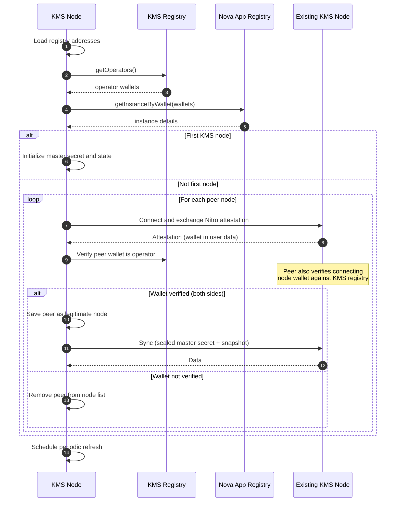
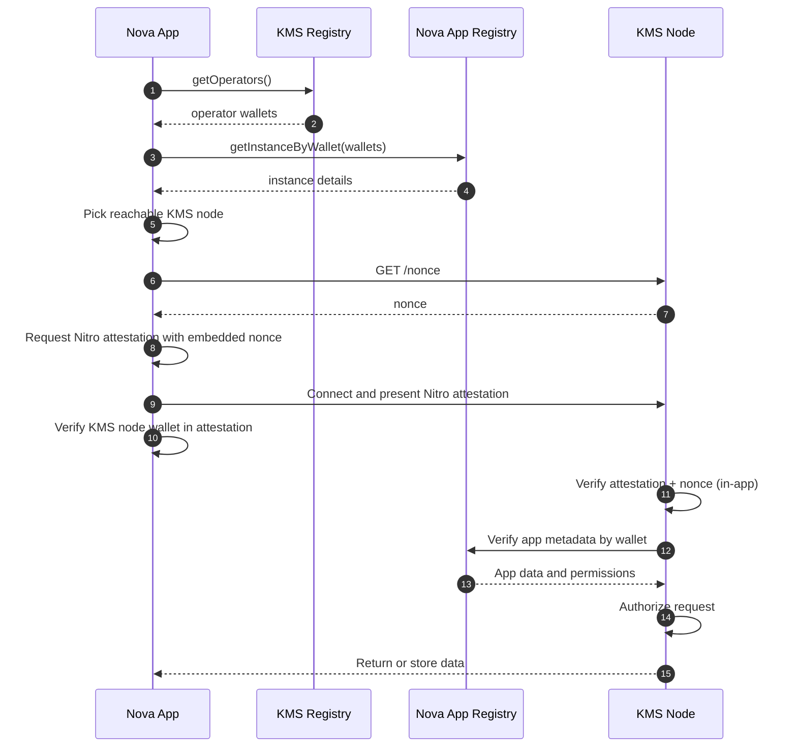

# KMS Core Workflows

This document consolidates the core KMS workflows for deployment, node enrollment, node initialization, and Nova app access.

## KMS Registry Deployment Workflow

This workflow describes how to deploy the KMS registry and wire it into Nova App Registry so KMS nodes and Nova apps can discover it.

### Workflow

1. Set the Nova App Registry address in the deploy script or environment.
2. Deploy the KMS registry contract.
3. Record the deployed KMS registry address.
4. When creating the KMS service as a Nova app in Nova Platform, set the KMS registry contract address as the app contract address. This is recorded in Nova App Registry.

### Mermaid Diagram

## KMS Node Join Workflow

This workflow describes how a KMS node is enrolled into the KMS registry by Nova Platform.

### Workflow

1. The KMS service is registered as a Nova app, and the KMS registry contract address is set as the app contract address in Nova Platform.
2. Nova App Registry stores app metadata (KMS app id, KMS registry contract address), enrolled versions, and code measurements per version.
3. A KMS node is deployed on Nova Platform with the KMS registry as the app contract address.
4. Nova Platform submits the node ZK proof to Nova App Registry for on-chain verification.
5. Nova Platform verifies the node code measurement against the enrolled version.
6. If all checks pass, Nova Platform registers the node as a KMS app instance.
7. Nova App Registry calls `addOperator` on the KMS registry to add the node wallet.

### Mermaid Diagram

## KMS Node Initialization Workflow

This workflow describes how a KMS node initializes itself after deployment.

### Workflow

0. Configure the Nova App Registry and KMS registry addresses.
1. Query the KMS registry to get all operator wallets.
2. Query the Nova App Registry for instance details of each operator.
3. If this is the first KMS node, perform initial setup (master secret, namespace bootstrap).
4. If this is not the first node, synchronize from existing KMS nodes:
    4.1 Establish a connection and obtain the peer's Nitro attestation document.
    4.2 Extract the peer's wallet address from the signed attestation `user_data` and verify it exists in the KMS registry.
    4.3 If verified, save the peer as a legitimate KMS node. Otherwise, treat the peer as invalid and remove it from the node list.
    4.4 On the receiving side, the peer node also extracts the connecting node's wallet address from the attestation `user_data` and verifies it against the KMS registry. If the wallet is not a registered operator, the peer rejects the sync request.
    4.5 Synchronize data from the verified peer (master secret via sealed ECDH, then snapshot + deltas).
    4.6 Repeat steps 4.1–4.5 for all discovered nodes.
5. Periodically repeat step 1 to refresh the operator list.

### Mermaid Diagram

## Nova App Access to KMS Workflow

This workflow describes how a Nova app discovers and accesses the KMS service.

> **Note on authentication:** When a Nova app accesses a KMS node, the KMS node verifies the app's wallet address against **Nova App Registry** (app identity). When a KMS node syncs with another KMS node, each side verifies the other's wallet address against **KMS Registry** (operator identity). Attestation is verified **inside the enclave app** (no trusted proxies).

### Workflow

0. Configure the Nova App Registry and KMS registry addresses.
1. Query the KMS registry to get all operator wallets.
2. Query the Nova App Registry for instance details of each operator.
3. Select a reachable KMS node from the list.
4. Call `GET /nonce` on the selected KMS node to obtain a one-time challenge nonce.
5. Use the nonce when requesting a Nitro attestation from Odyn so that it is embedded into the attestation document (payload `nonce` field).
6. Establish a connection with the selected KMS node and provide a Nitro attestation document (for example via the `x-nitro-attestation` header). The signed attestation `user_data` includes the wallet address.
7. The client validates that the wallet address in the KMS node attestation matches the operator wallet from the KMS registry. If it does not match, abort.
8. The KMS node validates the app identity and metadata:
    8.1 Verifies the Nitro attestation against AWS Nitro Root-G1 and checks that the embedded nonce matches a recently issued, unused nonce.
    8.2 Extracts wallet address and measurement from the attestation `user_data`.
    8.3 Queries Nova App Registry for app metadata by wallet and validates status / measurement.
9. The KMS node returns or stores data for the app.

### Mermaid Diagram

