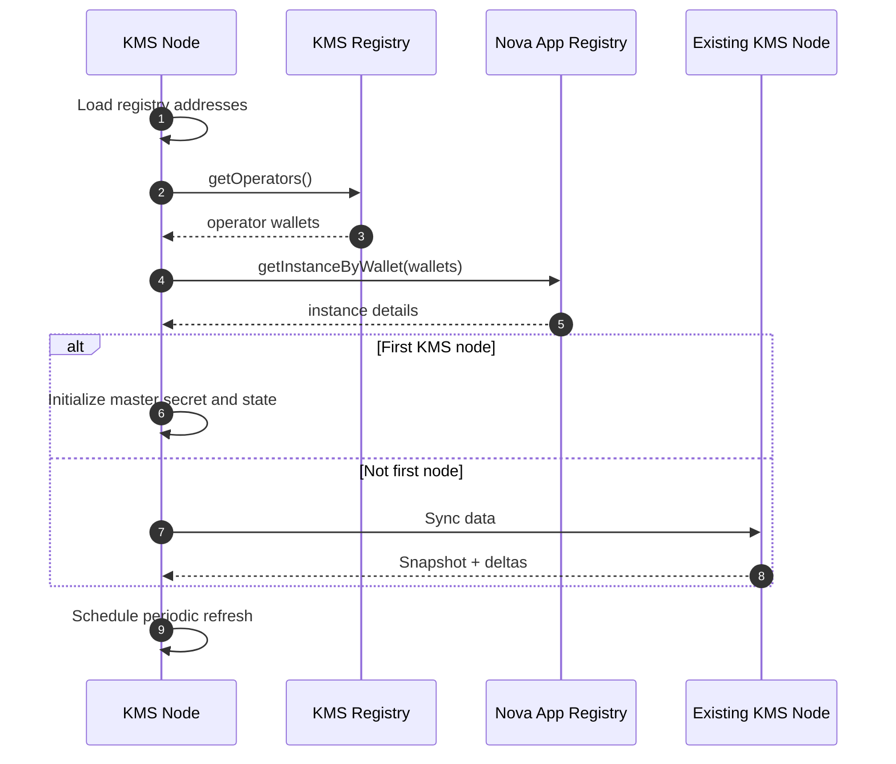

# KMS Node Initialization Workflow

This document describes how a KMS node initializes itself after deployment.

## Workflow

0. Configure the Nova App Registry and KMS registry addresses.
1. Query the KMS registry to get all operator wallets.
2. Query the Nova App Registry for instance details of each operator.
3. If this is the first KMS node, perform initial setup (master secret, namespace bootstrap).
4. If this is not the first node, synchronize from an existing KMS node.
5. Periodically repeat step 1 to refresh the operator list.

## Mermaid Diagram

