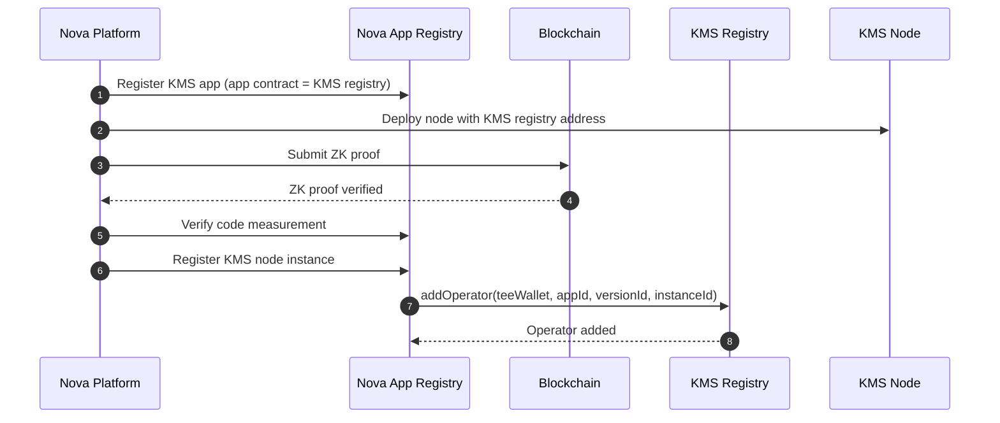

# KMS Node Join Workflow

This document describes how a KMS node is enrolled into the KMS registry by Nova Platform.

## Workflow

1. The KMS service is registered as a Nova app, and the KMS registry contract address is set as the app contract address in Nova Platform.
2. Nova App Registry stores app metadata (KMS app id, KMS registry contract address), enrolled versions, and code measurements per version.
3. A KMS node is deployed on Nova Platform with the KMS registry as the app contract address.
4. Nova Platform generates a node ZK proof and verifies it on-chain.
5. Nova Platform verifies the node code measurement against the enrolled version.
6. If all checks pass, Nova Platform registers the node as a KMS app instance.
7. Nova App Registry calls `addOperator` on the KMS registry to add the node wallet.

## Mermaid Diagram

