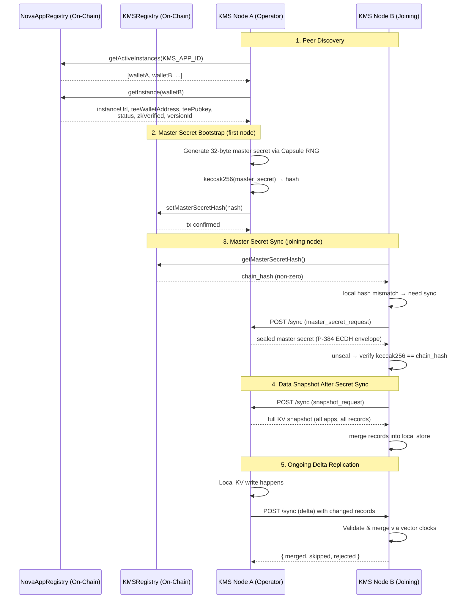
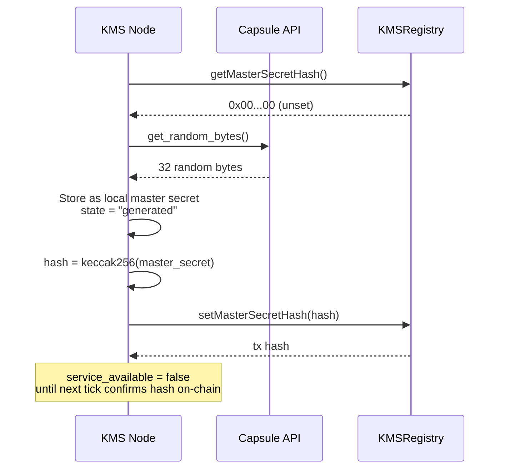
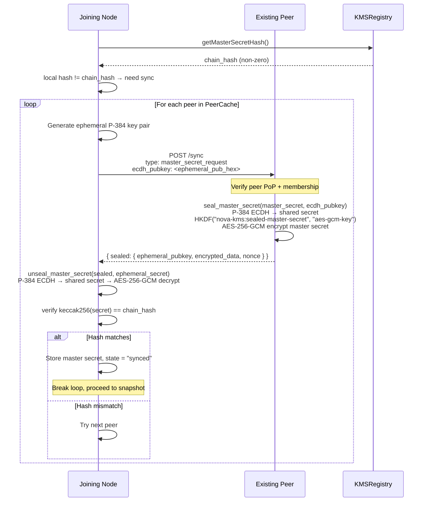
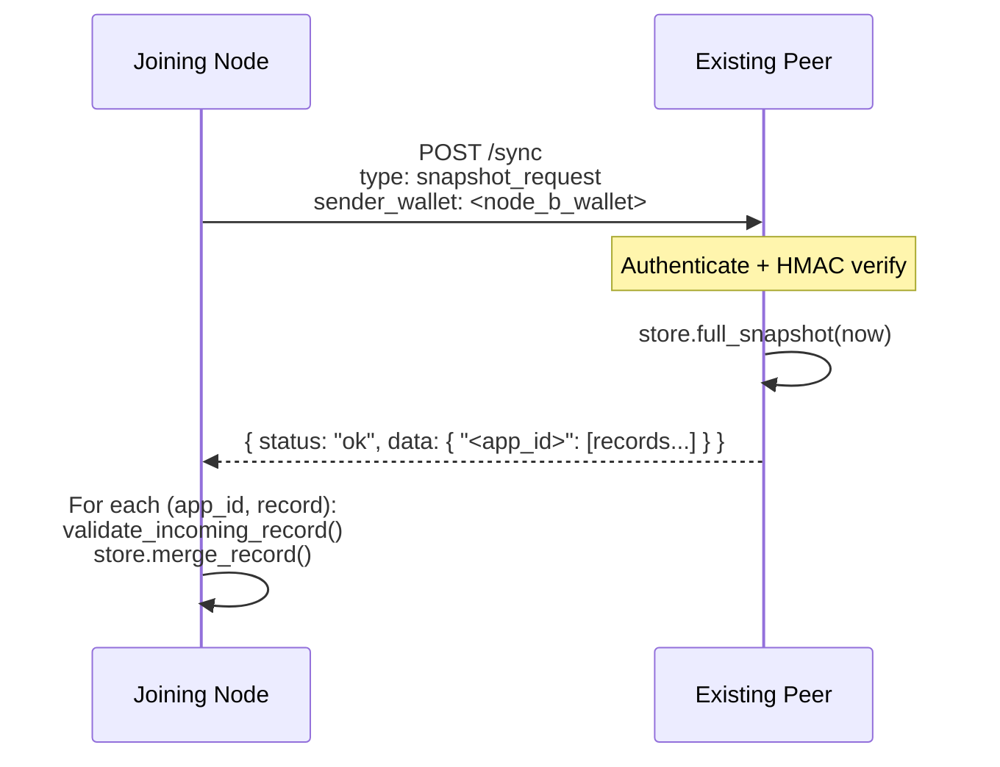
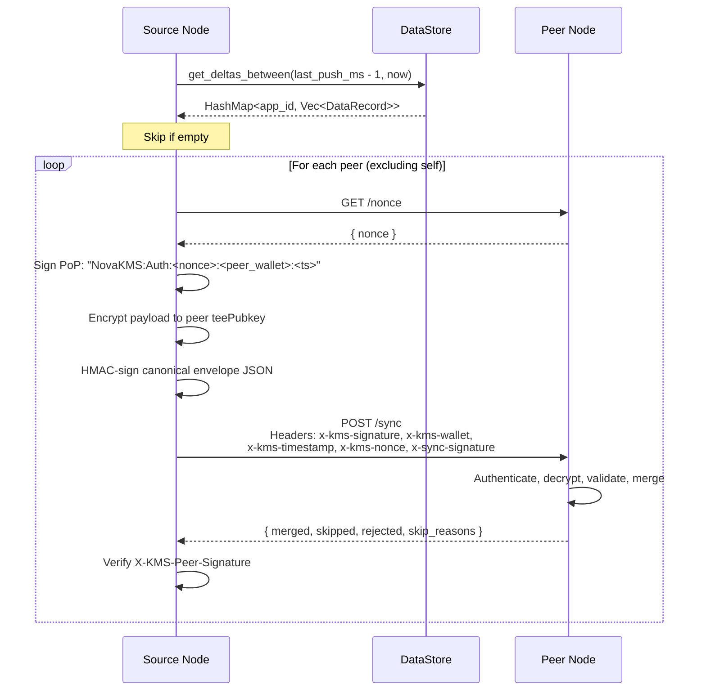
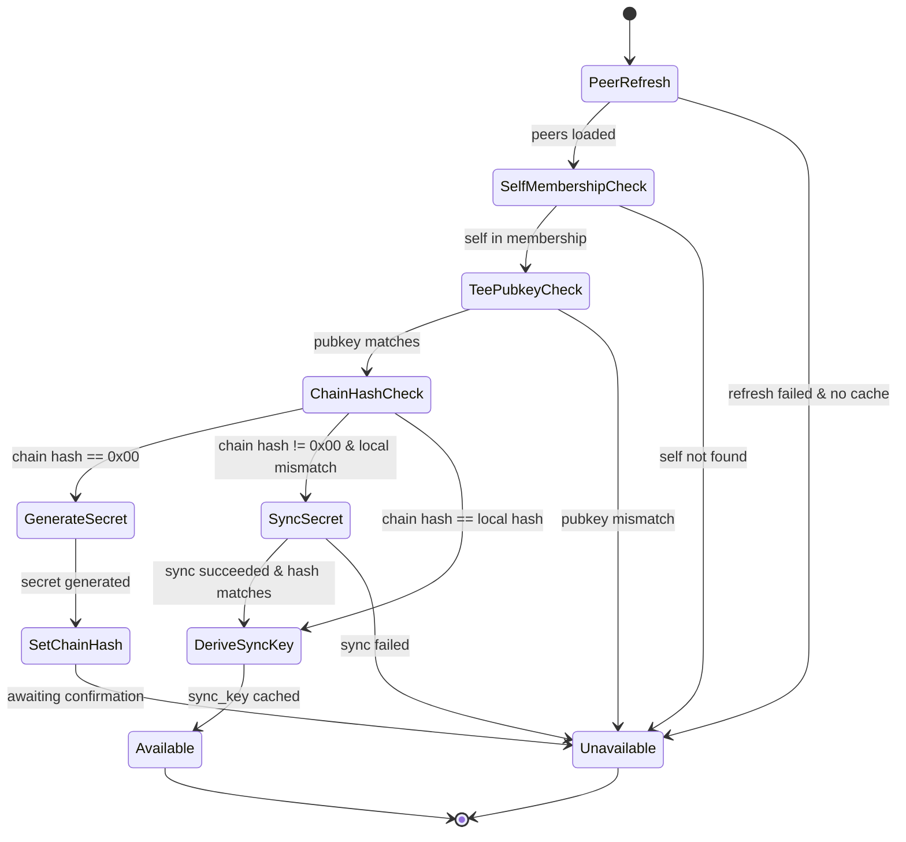

# KMS Nodes Internal Connections

This document describes how KMS nodes within the same cluster discover each other, authenticate peer requests, synchronize the master secret, and replicate KV data.

## Cluster Topology Overview



## 1. Peer Discovery

Every `node_tick` cycle (configured by `KMS_NODE_TICK_SECONDS`), each node refreshes its `PeerCache`:

1. Call `NovaAppRegistry.getActiveInstances(KMS_APP_ID)` to get all active wallet addresses.
2. For each wallet, fetch the full instance record: `instanceUrl`, `teeWalletAddress`, `teePubkey`, `status`, `zkVerified`, `versionId`.
3. Filter peers:
   - Instance status must be `ACTIVE` (status=0)
   - `zkVerified` must be `true`
   - Version status must be `ENROLLED` (0) or `DEPRECATED` (1)
   - Instance URL must be valid (HTTPS in enclave, HTTP or HTTPS in dev)
4. In enclave mode, probe each peer's `/status` endpoint (3-second timeout) to record reachability.
5. Store results in the local `PeerCache`.

A node also verifies its own membership:

- If the node's own wallet is not found in the active set, the node sets `service_available = false`.
- If the node's local `teePubkey` (from Capsule) does not match the registry entry, the node sets `service_available = false`.

The peer cache has a configurable TTL (`PEER_CACHE_TTL_SECONDS`). Stale caches are refreshed before outbound sync operations.

Peers can be blacklisted temporarily (`PEER_BLACKLIST_DURATION_SECONDS`) if repeated failures occur. Blacklisted peers are excluded from `get_peers()` results.

## 2. Peer Authentication (PoP)

All `/sync` requests between nodes use peer PoP authentication, similar to app PoP but with different header names and message format.

### 2.1 Request Headers

The calling node sends:

| Header | Value |
| --- | --- |
| `x-kms-signature` | EIP-191 signature of the PoP message |
| `x-kms-wallet` | Caller's wallet address |
| `x-kms-timestamp` | Unix seconds |
| `x-kms-nonce` | Nonce obtained from the target's `GET /nonce` |
| `x-sync-signature` | HMAC-SHA256 of the canonical envelope JSON (not required for `master_secret_request`) |

### 2.2 PoP Message Format

```text
NovaKMS:Auth:<nonce_b64>:<recipient_wallet>:<timestamp>
```

Where `recipient_wallet` is the target node's wallet address.

### 2.3 Verification Steps

The receiving node performs:

1. Parse and validate `x-kms-timestamp` freshness against `POP_TIMEOUT_SECONDS`.
2. Validate `x-kms-nonce` is valid base64 and consume it (single-use).
3. Recover the signer wallet from the PoP signature.
4. Optionally verify `x-kms-wallet` matches the recovered signer.
5. Look up the recovered wallet in `PeerCache.verify_kms_peer()`:
   - Peer must exist in the cache
   - Peer must be ACTIVE
   - Peer must be `zkVerified`
   - Peer `app_id` must equal `KMS_APP_ID`
   - Peer must have a non-empty `teePubkey`
6. Verify `sender_tee_pubkey` in the encrypted envelope matches the peer's on-chain `teePubkey`.

### 2.4 HMAC Verification

For `delta` and `snapshot_request` sync types, the receiving node also verifies `x-sync-signature`:

- The sync key is derived from the master secret: `HKDF-SHA256(master_secret, salt="nova-kms:app:0", info="sync_hmac_key")`.
- The HMAC is computed over the canonical (sorted-key) JSON of the encrypted envelope body.
- `master_secret_request` is exempt from HMAC verification because the requesting node may not yet have the master secret.

### 2.5 Response Signature

The responding node signs the response with:

```text
NovaKMS:Response:<caller_signature>:<responder_wallet>
```

This is returned in the `X-KMS-Peer-Signature` header. The caller verifies this signature against the target peer's known wallet.

## 3. Encrypted Communication

All `/sync` requests and responses use the same E2E encrypted envelope as app requests:

```json
{
  "sender_tee_pubkey": "<hex DER/SPKI>",
  "nonce": "<hex>",
  "encrypted_data": "<hex>"
}
```

- The sender encrypts the inner JSON to the target peer's `teePubkey` (P-384) via Capsule.
- The receiver verifies `sender_tee_pubkey` matches the authenticated peer's on-chain `teePubkey`.
- The receiver decrypts with Capsule.
- The response is encrypted back to the sender's `teePubkey`.

Plaintext sync payloads are rejected.

## 4. Master Secret Lifecycle

### 4.1 Overview

The master secret is a 32-byte value shared by all nodes in the cluster. It is the root key from which all per-app keys are derived:

- **App derive key**: `HKDF-SHA256(master_secret, salt="nova-kms:app:<app_id>", info="<path>:<context>")`
- **Data encryption key**: `HKDF-SHA256(master_secret, salt="nova-kms:app:<app_id>", info="data_key")`
- **Sync HMAC key**: `HKDF-SHA256(master_secret, salt="nova-kms:app:0", info="sync_hmac_key")`

The on-chain `KMSRegistry` stores `masterSecretHash = keccak256(master_secret)` as the single source of truth for which secret the cluster should converge on.

### 4.2 First Node Bootstrap (Chain Hash Is Zero)

When a node sees `masterSecretHash == 0x00..00` on-chain:



The `setMasterSecretHash` call on the KMSRegistry contract succeeds only if:

- The caller is an ACTIVE KMS instance on an ENROLLED version.
- The current hash is `0x00..00` (can only be set once).

In dev mode (`IN_ENCLAVE=false`), if Capsule RNG fails, the node falls back to the local system RNG.

### 4.3 Joining Node Sync (Chain Hash Is Non-Zero)

When a node's local master secret hash does not match the on-chain `masterSecretHash`:



The sealed master secret exchange uses ephemeral P-384 ECDH:

1. The requesting node generates a one-time P-384 key pair.
2. The `ecdh_pubkey` (DER-encoded) is sent in the `master_secret_request` payload.
3. The responding node generates its own ephemeral P-384 key pair.
4. Both sides compute the ECDH shared secret.
5. The exchange key is derived: `HKDF-SHA256(shared_secret, salt="nova-kms:sealed-master-secret", info="aes-gcm-key")`.
6. The master secret is AES-256-GCM encrypted with a random 12-byte nonce.
7. The sealed envelope contains: `ephemeral_pubkey`, `encrypted_data`, `nonce` (all hex-encoded).

This exchange happens **inside** the already E2E-encrypted Capsule envelope, providing two layers of encryption.

After receiving the master secret, the joining node also derives the `sync_key` and caches it in `AppState`.

### 4.4 MasterSecretManager States

| State | Meaning |
| --- | --- |
| `uninitialized` | No master secret loaded |
| `generated` | This node generated the secret and set the chain hash |
| `synced` | Secret was received from a peer (with `synced_from` URL) |

## 5. Data Snapshot Sync

Immediately after successfully syncing the master secret, the joining node requests a full data snapshot:



### 5.1 Snapshot Payload Structure

```json
{
  "type": "snapshot_request",
  "sender_wallet": "<wallet>"
}
```

Response:

```json
{
  "status": "ok",
  "data": {
    "49": [
      {
        "key": "path/to/key",
        "value": "<hex encrypted_value>",
        "version": { "node-a-wallet": 3, "node-b-wallet": 1 },
        "updated_at_ms": 1730000000000,
        "tombstone": false,
        "ttl_ms": 0
      }
    ]
  }
}
```

### 5.2 Record Validation

Each incoming record is validated before merge:

- Non-tombstone records: encrypted value size must be ≤ `MAX_KV_VALUE_SIZE_BYTES + 128` bytes.
- In enclave mode: ciphertext must be at least 28 bytes (12-byte nonce + 16-byte tag) and must decrypt successfully with the app's `data_key`.
- Clock skew check: `updated_at_ms` must not exceed `now + MAX_CLOCK_SKEW_MS`.

## 6. Delta Replication

After initial sync, ongoing changes are replicated via delta pushes.

### 6.1 Outbound Push (`sync_tick`)

`sync_tick()` runs every `DATA_SYNC_INTERVAL_SECONDS` when `service_available = true` and a `sync_key` exists.



### 6.2 Delta Payload Structure

```json
{
  "type": "delta",
  "sender_wallet": "<wallet>",
  "data": {
    "49": [
      {
        "key": "path/to/key",
        "value": "<hex encrypted_value>",
        "version": { "node-a-wallet": 4 },
        "updated_at_ms": 1730000001000,
        "tombstone": false,
        "ttl_ms": 60000
      }
    ]
  }
}
```

Tombstone records have `"value": null` and `"tombstone": true`.

### 6.3 Inbound Merge

The receiving node processes each incoming record:

1. **Validate** the record (same rules as snapshot validation).
2. **Merge** using vector clock comparison:

| Vector Clock Comparison | Outcome |
| --- | --- |
| Incoming **happened-after** local | Replace local record |
| Incoming **happened-before** local | Ignore (local is newer) |
| **Equal** | Ignore (already have it) |
| **Concurrent** | Last-writer-wins by `updated_at_ms`, then by `encrypted_value` byte comparison. Merged version = merge of both vector clocks |

### 6.4 Delta Response

```json
{
  "status": "ok",
  "total": 5,
  "merged": 3,
  "skipped": 1,
  "rejected": 1,
  "skip_reasons": {
    "ignored_equal_version": 1
  }
}
```

## 7. Key Derivation Hierarchy

All cryptographic keys in the cluster derive from the single shared master secret:

```
master_secret (32 bytes)
├── Per-app derive key
│   HKDF(salt="nova-kms:app:<app_id>", info="<path>" or "<path>:<context>")
│   → 1..1024 bytes, returned to app via /kms/derive
│
├── Per-app data encryption key
│   HKDF(salt="nova-kms:app:<app_id>", info="data_key")
│   → 32 bytes, AES-256-GCM key for encrypting KV values at rest
│
└── Sync HMAC key
    HKDF(salt="nova-kms:app:0", info="sync_hmac_key")
    → 32 bytes, used for x-sync-signature on /sync requests
```

## 8. Node Readiness State Machine

`node_tick()` drives the readiness state. A node becomes `service_available = true` only after passing all checks:



## 9. Configuration Reference

| Config Key | Default | Description |
| --- | --- | --- |
| `KMS_NODE_TICK_SECONDS` | — | Interval for `node_tick` (peer refresh, master secret reconciliation) |
| `DATA_SYNC_INTERVAL_SECONDS` | — | Interval for `sync_tick` (delta push) |
| `PEER_CACHE_TTL_SECONDS` | — | How long the peer cache is valid before forced refresh |
| `PEER_BLACKLIST_DURATION_SECONDS` | — | Duration a failing peer is excluded |
| `POP_TIMEOUT_SECONDS` | — | Maximum age of a PoP timestamp |
| `MAX_CLOCK_SKEW_MS` | — | Maximum allowed future timestamp on incoming records |
| `MAX_KV_VALUE_SIZE_BYTES` | — | Maximum plaintext value size for writes |
| `MAX_APP_STORAGE_BYTES` | — | Maximum encrypted storage per app namespace |
| `MAX_SYNC_PAYLOAD_BYTES` | — | Maximum allowed sync request body size |
| `TOMBSTONE_RETENTION_MS` | — | How long tombstones are kept before cleanup |
| `MAX_TOMBSTONES_PER_APP` | — | Maximum tombstone records per namespace |
