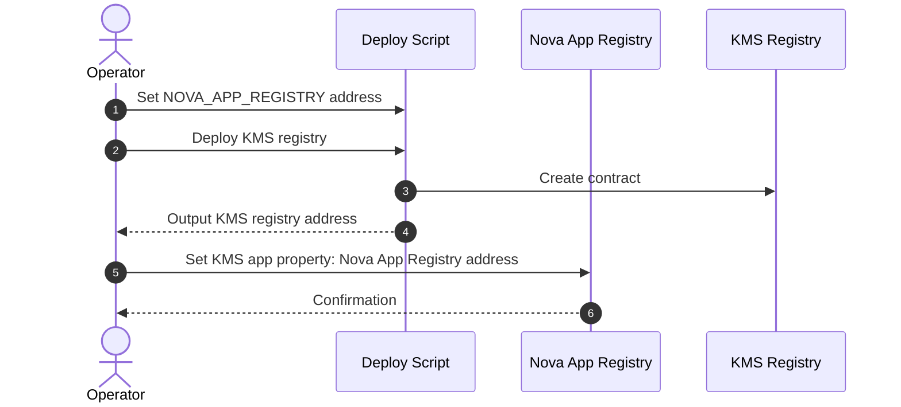

# KMS Registry Deployment Workflow

This document describes how to deploy the KMS registry and wire it into Nova App Registry so KMS nodes and Nova apps can discover it.

## Workflow

1. Set the Nova App Registry address in the deploy script or environment.
2. Deploy the KMS registry contract.
3. Record the deployed KMS registry address.
4. When creating the KMS app in Nova Platform, set the Nova App Registry contract address as a KMS app property.

## Mermaid Diagram

