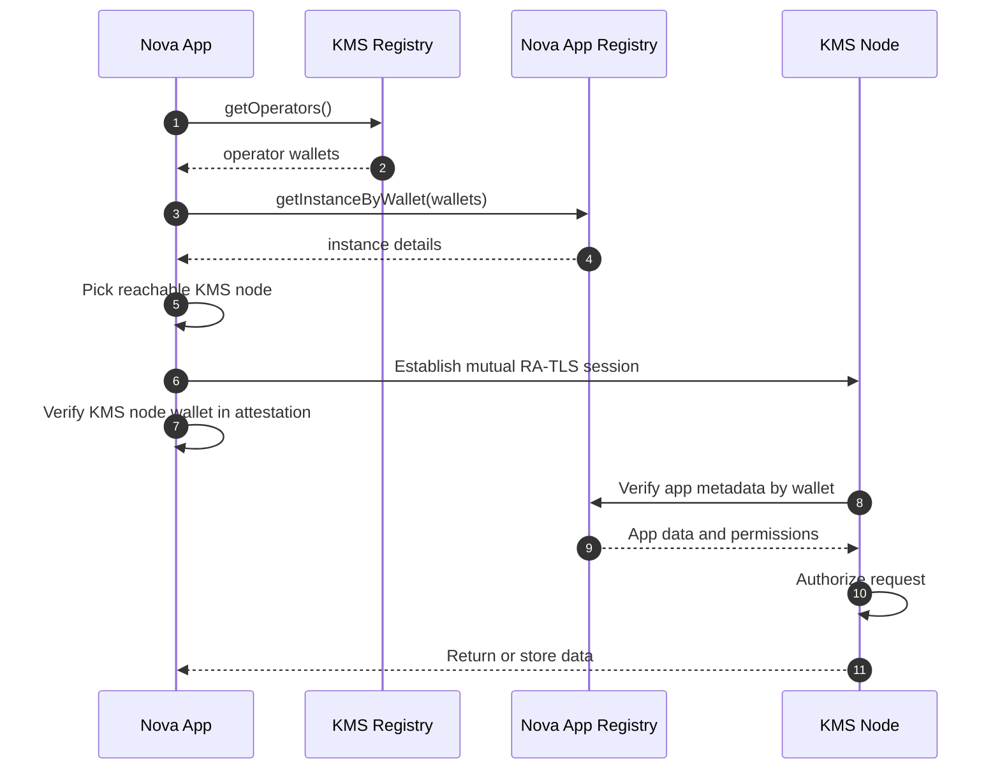

# Nova App Access to KMS Workflow

This document describes how a Nova app discovers and accesses the KMS service.

## Workflow

0. Configure the Nova App Registry and KMS registry addresses.
1. Query the KMS registry to get all operator wallets.
2. Query the Nova App Registry for instance details of each operator.
3. Select a reachable KMS node from the list.
4. Establish mutual RA-TLS with the selected KMS node. The attestation user data includes the wallet address.
5. The client validates that the wallet address in the KMS node attestation matches the operator wallet from the KMS registry. If it does not match, abort.
6. The KMS node validates the app identity and metadata:
    6.1 Extract wallet address and public key from the app attestation.
    6.2 Query Nova App Registry for app metadata by wallet.
    6.3 Authorize access based on registry data.
7. The KMS node returns or stores data for the app.

## Mermaid Diagram

